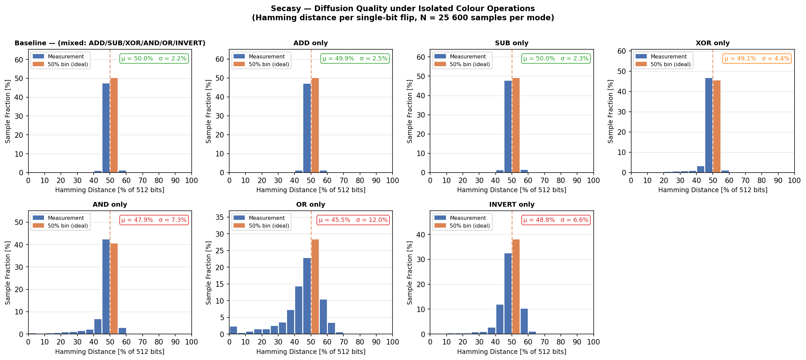
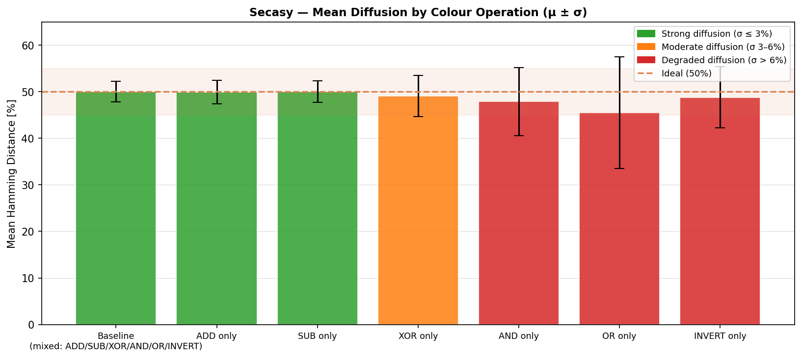
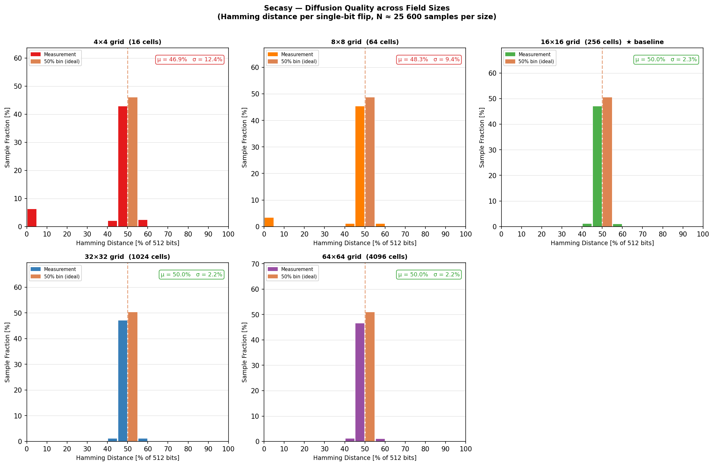
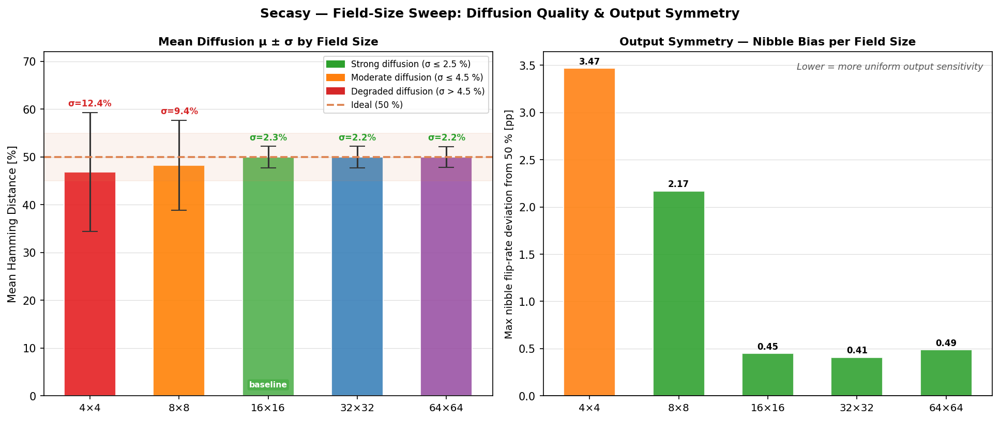
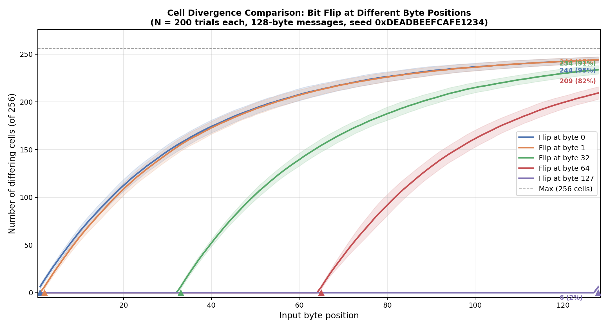
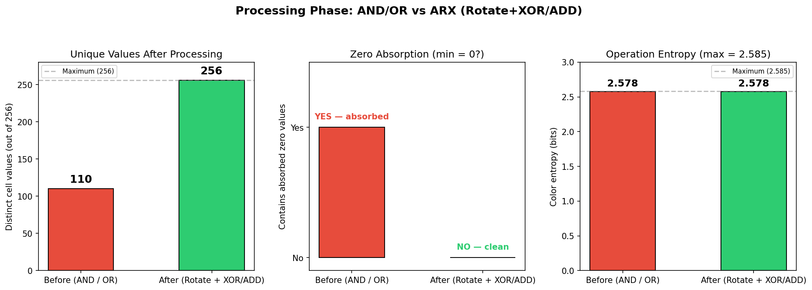

\newpage

# Secasy — Algorithmus-Beschreibung

## Inhaltsverzeichnis

1. Motivation — Warum ein neuer Hash-Algorithmus?
2. Das Kernkonzept — Gitterbasierter Zustand
3. Datenstruktur im Detail
4. Phase 1 — Initialisierung
5. Phase 2 — Eingabe-Integration (Fingerprint-Bildung)
6. Phase 3 — Verarbeitungsrunden (Diffusion)
7. Phase 4 — Hash-Extraktion
8. Sicherheitsargumente
9. Vergleich mit bekannten Konstruktionen
10. Bekannte Grenzen und offene Fragen
11. Literatur

Anhang A — Empirische Isolation einzelner Farb-Operationen

Anhang B — Einfluss der Feldgröße auf die Diffusion

Anhang C — Zell-Divergenzwachstum pro Eingabebyte

Anhang D — ARX-Migration: Ersetzung von AND/OR durch rotationsbasierte Operationen

---

\newpage

## 1. Motivation — Warum ein neuer Hash-Algorithmus?

### Das dominante Paradigma: Merkle-Damgård

Die bekanntesten kryptographischen Hash-Funktionen — MD5, SHA-1, SHA-256,
SHA-512 — basieren alle auf der **Merkle-Damgård-Konstruktion** aus dem Jahr
1989 [@merkle1990; @damgard1990]. Das Prinzip ist einfach: Die Eingabe wird in gleich große Blöcke
aufgeteilt, die sequenziell durch eine Kompressionsfunktion verarbeitet werden.
Der Ausgabe-Zustand nach dem letzten Block ist der Hash.

Diese lineare Verarbeitungskette hat eine bekannte strukturelle Schwäche:
den **Length Extension Attack**. Kennt ein Angreifer $H(m)$, kann er — ohne
$m$ zu kennen — $H(m \| \text{padding} \| m')$ für beliebige Fortsetzungen
$m'$ berechnen. Der Grund: Der Hash-Ausgabewert *ist* der interne Zustand
der Kompressionsfunktion; der Angreifer „setzt" die Berechnung einfach fort.
SHA-3 (Keccak) [@nist_fips202] und BLAKE2 [@aumasson2013_blake2] lösen dieses Problem durch andersartige Konstruktionen.

### Die Leitfrage hinter Secasy

*Was passiert, wenn man den internen Zustand radikal von der Ausgabe entkoppelt
und die Diffusion räumlich statt sequenziell organisiert?*

Secasy erkundet diesen Ansatz: Ein **zweidimensionales Gitter** als Zustandsraum,
in dem jedes Eingabebyte eine nichtlineare Bewegung durch das Gitter auslöst
und dabei Zellen verändert. Der interne Zustand (16.384 Bit) ist um den Faktor
32 größer als die Ausgabe (512 Bit) — was Length Extension strukturell
unmöglich macht und gleichzeitig die Bound gegen Kollisionsangriffe verbreitert.

---

## 2. Das Kernkonzept — Gitterbasierter Zustand

### Räumliche statt sequenzieller Diffusion

Klassische Hash-Funktionen bewegen Daten durch eine Kette von Blöcken:

```
Eingabe → [Block₁] → [Block₂] → [Block₃] → ... → Hash
```

Secasy hingegen bewegt einen **Cursor** durch ein zweidimensionales Feld:

```
           Spalte 0   1   2  ...  15
Zeile 0  [ ●   ·   ·  ...  · ]
Zeile 1  [ ·   ·   ·  ...  · ]
...      [                    ]
Zeile 15 [ ·   ·   ·  ...  · ]
              ↑
         256 Zellen, jede mit eigenem Zustand
```

Jedes Eingabebyte wird in vier 2-Bit-Richtungscodes zerlegt. Jeder Code
steuert eine Cursorbewegung und modifiziert die besuchte Zelle. Nach dem
letzten Eingabebyte trägt das Gitter einen **einzigartigen Fingerabdruck**
der Eingabe — dann erst beginnt die eigentliche Diffusionsphase.

### Warum ist das strukturell anders?

Bei Merkle-Damgård ist der Zustand nach Block $i$ vollständig durch die
Ausgabe von Block $i$ beschrieben — der Zustandsraum ist gleich groß wie
die Ausgabe. Bei Secasy ist der Zustandsraum $256 \times 64 = 16.384$ Bit
groß, die Ausgabe jedoch nur 512 Bit. Selbst mit vollständiger Kenntnis
des Hash-Wertes hat der Angreifer nur 3 % des internen Zustands — eine
Rekonstruktion des Feldes ist algebraisch nicht durchführbar.

---

## 3. Datenstruktur im Detail

Das Gitter besteht aus **256 Zellen** in einem 16×16-Raster. Jede Zelle
speichert drei unabhängige Werte:

| Feld         | Typ        | Bedeutung                                                                     |
|--------------|------------|-------------------------------------------------------------------------------|
| `value`      | `uint64_t` | Numerischer Zellwert; wird durch Operationen verändert                        |
| `primeIndex` | `uint32_t` | Zeiger in die vorberechnete Primzahltabelle                                   |
| `colorIndex` | `uint8_t`  | Bestimmt, welche der 6 Operationen in Phase 3 auf diese Zelle angewendet wird |

Zusätzlich gibt es eine **Primzahltabelle** (`primes.h`) mit den ersten
16.000.000 Primzahlen (~355 KB). Diese Tabelle wird bei der Initialisierung
aus dem Header kompiliert und dient als deterministischer Zufallsgenerator
für Sprungweiten.

Der **Cursor** ist eine zweidimensionale Position $(x, y)$ im Bereich
$[0, 15] \times [0, 15]$, die sich während Phase 2 durch das Gitter bewegt.

---

## 4. Phase 1 — Initialisierung

Die Initialisierung ist **eingabe-unabhängig** und vollständig deterministisch.
Jede Ausführung beginnt vom selben Ausgangszustand:

- Alle 256 Zellen: `value = 2`, `primeIndex = 0`, `colorIndex = ADD`
- Cursor: Position $(0, 0)$

Der Wert 2 ist der Startwert. Es ist die erste Primzahl und dient als Initialisierung. Natürlich hätte man auch 1 oder
jede andere Initialisierung nehmen können, wir haben uns aus rein pragmatischen Gründen für die 2 entschieden.

---

## 5. Phase 2 — Eingabe-Integration (Fingerprint-Bildung)

Dies ist die **kritische Phase** für Kollisionsresistenz. Hier wird aus der
Eingabe ein eindeutiger Gitterzustand — ein Fingerabdruck — geformt.

### Byte-Zerlegung

Jedes Eingabebyte (8 Bit) wird in vier **2-Bit-Richtungscodes** zerlegt:

| Bits | Richtung       |
|------|----------------|
| `00` | UP (oben)      |
| `01` | RIGHT (rechts) |
| `10` | LEFT (links)   |
| `11` | DOWN (unten)   |

Ein Byte erzeugt also vier Cursorbewegungen. Für jede Bewegung werden
**zwei Operationen** in der aktuellen Zelle $(x, y)$ ausgeführt:

### Operation A — Richtungsabhängiges Prime Update

1. `primeIndex` der Zelle wird um $1 + d$ erhöht, wobei $d \in \{0, 1, 2, 3\}$
   der 2-Bit-Richtungscode ist (UP=0, RIGHT=1, LEFT=2, DOWN=3). Das bedeutet:
   UP erhöht um +1, RIGHT um +2, LEFT um +3, DOWN um +4.
2. `colorIndex` wird zyklisch weitergeschaltet (0 → 1 → 2 → 3 → 4 → 5 → 0)
3. `value` der Zelle wird mit der Primzahl am neuen Index überschrieben

Die richtungsabhängige Erhöhung ist der **primäre Mechanismus zur Brechung
der Wert-Symmetrie**: Zwei Eingaben, die dieselbe Zelle über verschiedene
Richtungen besuchen, schreiben verschiedene Primzahlen in diese Zelle —
selbst beim allerersten Besuch. Zusätzlich bestimmt die zyklische
Fortschaltung des `colorIndex` die **Reihenfolge**, in der Zellen besucht
werden, welche Operation später in Phase 3 auf sie angewendet wird — nicht
der Inhalt des Eingabebytes direkt.

### Operation B — Datenabhängiger Sprung

Der Cursor bewegt sich zur nächsten Position. Jede Richtung aktualisiert
genau **eine** Koordinate — die **Primärachse** — um einen datenabhängigen
Offset, der vom alten Zellwert abgeleitet wird:

| Richtung | Formel                          |
|----------|---------------------------------|
| UP       | `y = (y - oldPrime) & 15`       |
| DOWN     | `y = (y + oldPrime + SAV) & 15` |
| LEFT     | `x = (x - oldPrime) & 15`       |
| RIGHT    | `x = (x + oldPrime + SAV) & 15` |

(`SAV` = `SQUARE_AVOIDANCE_VALUE` = 1, ein konstanter Offset der nur bei DOWN
und RIGHT angewendet wird. Dies bricht die Symmetrie zwischen
gegenüberliegenden Richtungen auf derselben Achse: UP und DOWN von derselben
Zelle mit demselben `oldPrime` landen auf **verschiedenen** Zielzellen. Ohne
SAV würden gegenüberliegende Richtungen spiegelsymmetrische Sprünge erzeugen,
was ausnutzbare Pfad-Symmetrien für wiederholte Byte-Eingaben schaffen würde.)

Alle Koordinaten werden mit `& 15` auf
$[0, 15]$ begrenzt. Da die Feldgröße $N = 16 = 2^4$ eine Zweierpotenz ist, gilt:

$$x \bmod N \;=\; x \;\&\; (N-1) \;=\; x \;\&\; 15$$

Die bitweise UND-Operation ersetzt die Division und ist deutlich schneller.)

Da UP und DOWN nur $y$ modifizieren, während LEFT und RIGHT nur $x$
modifizieren, sind Cursorbewegungen entlang verschiedener Achsen
**unabhängig**: Die Endposition ist die komponentenweise Summe aller
Einzelsprünge pro Achse. Zwei Richtungsfolgen, die denselben Multiset
an achsenspezifischen Offsets enthalten, landen auf derselben Zelle —
unabhängig von der Reihenfolge der Richtungen. Formal gilt für zwei
Richtungen $d_1, d_2$ auf **verschiedenen** Achsen:

$$\text{move}(d_1) \circ \text{move}(d_2) = \text{move}(d_2) \circ \text{move}(d_1)$$

Diese Kommutativität ist eine **bekannte strukturelle Einschränkung**, die
prinzipiell zu Pfad-Kollisionen führen kann (siehe Abschnitt 10).

Konkret betrachte man zwei Bytes, die sich nur in den untersten 2 Bits
unterscheiden, z.B. `0x1A` (Bits: `00 01 10 00`) und `0x1B`
(Bits: `00 01 10 11`). Der erste 2-Bit-Block (`byte & 3`) ergibt LEFT (10)
vs. DOWN (11) — die drei nachfolgenden Schritte sind identisch. Da LEFT
nur $x$ und DOWN nur $y$ modifiziert, erzeugen diese beiden Richtungen
**orthogonale** Bewegungen auf dem Gitter. Beim Hashing wiederholter Bytes
(z.B. `0x1A` × 16 vs. `0x1B` × 16) können die 64 Einzelschritte dieselben
Zellen in permutierter Reihenfolge besuchen.

Frühere Tests mit einer Variante, die zusätzlich beide Achsen koppelte
(Sekundärachsen-Offset abgeleitet von der Primärachse), eliminierten diese
Kollisionsgruppen — führten aber einen anderen Fehler ein (Direction-Aliasing
durch Informationsverlust in der Kopplungsformel). Die Sekundärachsen-Kopplung
wurde daher entfernt.

Stattdessen wurden die Kollisionsgruppen durch die Einführung des
**richtungsabhängigen Prime-Advance** (siehe Operation A) und des
**Square Avoidance Value** (siehe Operation B) aufgelöst. Zusammen stellen
diese beiden Mechanismen sicher, dass Bytes innerhalb jeder Gruppe
verschiedene Zellwerte und verschiedene Sprungtrajektorien erzeugen —
trotz strukturell äquivalenter Cursor-Pfade. Exhaustive Tests aller 256
wiederholten Einzelbyte-Eingaben bestätigen 0 Kollisionen.

Die ursprünglich identifizierten Gruppen waren:

| Gruppe | Byte-Werte mit äquivalenter Pfadstruktur |
|--------|------------------------------------------|
| 1      | `0x1A`, `0x1B`, `0x1E`, `0x1F`           |
| 2      | `0x26`, `0x27`, `0x36`, `0x37`           |
| 3      | `0x29`, `0x2D`, `0x39`, `0x3D`           |
| 4      | `0x4A`, `0x4B`, `0x4E`, `0x4F`           |
| 5      | `0x86`, `0x87`, `0xC6`, `0xC7`           |

Das gemeinsame Muster: In jeder Gruppe unterscheiden sich die Bytes nur
in Bits, die zu Richtungen auf **verschiedenen Achsen** führen — die
resultierenden Cursor-Pfade sind Permutationen voneinander. Diese Gruppen
erzeugen keine Kollisionen mehr.

### Warum Kommutativität nicht zu Hash-Kollisionen führt

Obwohl die Cursorbewegung über verschiedene Achsen kommutativ ist, erzeugen
zwei permutierte Richtungsfolgen **keine** identischen Gitterzustände, aus
zwei unabhängigen Gründen:

1. **SAV bricht die Pfad-Identität ab dem ersten Schritt:** Der SAV-Offset
   auf DOWN/RIGHT bedeutet, dass die tatsächlichen Sprungdistanzen
   unterschiedlich sind. Beim allerersten Besuch (alle Zellen haben
   `oldPrime = 2`) springt UP um 2, während DOWN um 3 (= 2 + SAV) springt.
   Die Pfade divergieren sofort.

2. **Richtungsabhängiger Prime-Advance bricht die Wert-Identität:** Selbst
   wenn zwei Pfade hypothetisch dieselbe Zelle besuchen, schreiben
   verschiedene Richtungen verschiedene Primzahlen (z.B. LEFT erhöht
   `primeIndex` um +3, DOWN um +4). Unterschiedliche Zellwerte verursachen
   unterschiedliche nachfolgende Sprungdistanzen und erzeugen exponentiell
   divergierende Trajektorien.

Für eine Kollision müssten beide Pfade identische (`value`,
`primeIndex`, `colorIndex`)-Tupel in allen 256 Zellen hinterlassen —
trotz verschiedener Primzahlen bei jedem Schritt und verschiedener
Sprungtrajektorien. Exhaustive Tests aller 256 wiederholten
Einzelbyte-Eingaben bestätigen, dass keine solchen Kollisionen existieren.
Unter 50.000 zufälligen Nachrichten mit Einzelbit-Flips (12.800.000
Versuche) wurden keine Kollisionen beobachtet.

### Kollisionsresistenz durch Fingerprint-Eindeutigkeit

Zwei Eingaben erzeugen genau dann eine Kollision, wenn sie nach Phase 2
identische (`value`, `primeIndex`, `colorIndex`)-Tupel in **allen 256
Zellen** hinterlassen — trotz verschiedener Pfade, verschiedener
Besuchsreihenfolgen und primzahlgesteuerter Sprungweiten. Die kombinatorische
Komplexität des Zustandsraums ($\approx 2^{16.384}$) macht dies praktisch
unmöglich.

### Durchgerechnetes Beispiel: Hashing des Bytes `0x4E`

Um Phase 2 greifbar zu machen, folgt hier eine schrittweise Nachverfolgung
für die Ein-Byte-Eingabe `0x4E` = `01001110` binär. Von LSB nach MSB gelesen
ergibt sich die Richtungsfolge LEFT, DOWN, UP, RIGHT.

Ausgangszustand: Cursor bei $(0, 0)$, alle Zellen haben `value=2`, `primeIndex=0`.

| Schritt | Bits | Richtung | $\Delta$prime | Neue Primzahl | Alter Wert | Sprungformel       | Neue Pos. |
|---------|------|----------|---------------|---------------|------------|--------------------|-----------|
| 1       | `10` | LEFT     | +3            | 7             | 2          | $x=(0-2)\&15=14$   | $(14, 0)$ |
| 2       | `11` | DOWN     | +4            | 11            | 2          | $y=(0+2+1)\&15=3$  | $(14, 3)$ |
| 3       | `00` | UP       | +1            | 3             | 2          | $y=(3-2)\&15=1$    | $(14, 1)$ |
| 4       | `01` | RIGHT    | +2            | 5             | 2          | $x=(14+2+1)\&15=1$ | $(1, 1)$  |

Nach einem Byte wurden vier Zellen besucht. Jede enthält nun eine andere
Primzahl (7, 11, 3, 5) statt des initialen Werts 2 — und der Cursor
steht auf $(1, 1)$.

### Vergleich: `0x4E` vs `0x1B` — Gleiches Ziel, verschiedener Zustand

Das Byte `0x1B` = `00011011` dekodiert zu DOWN, LEFT, RIGHT, UP — die
**gleichen vier Richtungen** wie `0x4E`, nur in anderer Reihenfolge. Da alle
Quellzellen initial `value = 2` haben, ist die Netto-Verschiebung auf jeder
Achse identisch: Beide Cursor landen auf $(1, 1)$.

| Schritt | Bits | Richtung | $\Delta$prime | Neue Primzahl | Alter Wert | Sprungformel       | Neue Pos. |
|---------|------|----------|---------------|---------------|------------|--------------------|-----------|
| 1       | `11` | DOWN     | +4            | 11            | 2          | $y=(0+2+1)\&15=3$  | $(0, 3)$  |
| 2       | `10` | LEFT     | +3            | 7             | 2          | $x=(0-2)\&15=14$   | $(14, 3)$ |
| 3       | `01` | RIGHT    | +2            | 5             | 2          | $x=(14+2+1)\&15=1$ | $(1, 3)$  |
| 4       | `00` | UP       | +1            | 3             | 2          | $y=(3-2)\&15=1$    | $(1, 1)$  |

Beide Bytes enden auf $(1, 1)$. Trotzdem hinterlassen sie **verschiedene
Gitterzustände** — was beide Kollisions-Verhinderungsmechanismen demonstriert:

| Zelle     | `0x4E`            | `0x1B`            |
|-----------|-------------------|-------------------|
| $(0, 0)$  | 7 (LEFT, $+3$)    | 11 (DOWN, $+4$)   |
| $(14, 3)$ | 3 (UP, $+1$)      | 5 (RIGHT, $+2$)   |
| $(14, 0)$ | 11 (DOWN, $+4$)   | unverändert (= 2) |
| $(14, 1)$ | 5 (RIGHT, $+2$)   | unverändert (= 2) |
| $(0, 3)$  | unverändert (= 2) | 7 (LEFT, $+3$)    |
| $(1, 3)$  | unverändert (= 2) | 3 (UP, $+1$)      |

**Zwei unabhängige Effekte verhindern eine Kollision:**

1. **Richtungsabhängiger Prime-Advance** (Wert-Asymmetrie): Selbst an den
   zwei gemeinsamen Zellen — $(0, 0)$ und $(14, 3)$ — schreiben die Bytes
   verschiedene Primzahlen, weil LEFT ($+3$) vs DOWN ($+4$) und UP ($+1$)
   vs RIGHT ($+2$) den `primeIndex` unterschiedlich erhöhen.

2. **SAV-induzierte Pfad-Divergenz** (Pfad-Asymmetrie): Obwohl die
   Netto-Verschiebung identisch ist, unterscheiden sich die Zwischenpfade.
   `0x4E` besucht $(14, 0)$ und $(14, 1)$; `0x1B` besucht $(0, 3)$ und
   $(1, 3)$. Diese vier Zellen haben in jedem Gitter verschiedene Werte.

Insgesamt unterscheiden sich 6 von 256 Zellen nach einem einzigen Byte —
und da jeder nachfolgende Schritt Zellwerte liest, um Sprungweiten zu
berechnen, verstärken sich diese Unterschiede exponentiell mit jedem
weiteren Eingabebyte.

---

## 6. Phase 3 — Verarbeitungsrunden (Diffusion)

Nach der Eingabe-Integration wird das gesamte Gitter $r$ Mal (Standard: $r = 10$)
in Verarbeitungsrunden durchlaufen. In jeder Runde wird **jede Zelle**
aktualisiert — abhängig von ihrem `colorIndex`, der in Phase 2 festgelegt wurde:

| colorIndex | Operation                          | Nachbar |
|------------|------------------------------------|---------|
| 0 — ADD    | `value += Nachbar.value`           | oben    |
| 1 — SUB    | `value -= Nachbar.value`           | unten   |
| 2 — XOR    | `value ^= Nachbar.value`           | links   |
| 3 — RLX    | `value = ROL(value, 13) ^ Nachbar` | rechts  |
| 4 — RRA    | `value = ROR(value, 7) + Nachbar`  | links   |
| 5 — INVERT | `value = ~value`                   | —       |

Die Abkürzungen RLX und RRA stehen für **Rotate-Left–XOR** und
**Rotate-Right–Add**. Zusammen mit ADD, SUB und XOR bilden sie eine
**ARX**-Mischung (Add–Rotate–XOR) — eine gut untersuchte Operationsklasse,
die in SHA-512 [@nist_fips180_4], BLAKE2 [@aumasson2013_blake2] und ChaCha20
[@bernstein2008_chacha] verwendet wird. Die Rotationskonstanten 13 und 7
vermeiden die Ausrichtung an Bytegrenzen (Vielfache von 8) und gewährleisten
vollständige Bitmischung innerhalb eines 64-Bit-Wortes.

Randbehandlung: An Gitterkanten werden konstante Fallback-Werte (1 oder
unveränderter Wert) verwendet, um undefiniertes Verhalten zu vermeiden.

### Warum sechs verschiedene Operationen?

- **ADD / SUB:** Additive Operationen verteilen Werte global und sind
  invertierbar — sie allein würden lineare Strukturen hinterlassen.
- **XOR:** Bitweise, invertierbar, bricht lineare Korrelationen zwischen
  benachbarten Zellen.
- **RLX (Rotate-Left–XOR) / RRA (Rotate-Right–Add):** Rotation bricht die
  Positionsausrichtung von Bits; die anschließende XOR- bzw. modulare
  Addition koppelt den rotierten Wert mit einem Nachbarn. Die Kombination
  ist **nichtlinear bezüglich einzelner Bits**, da modulare Addition
  Überträge erzeugt, die sich unvorhersehbar fortpflanzen. Anders als die
  in früheren Versionen verwendeten AND/OR-Operationen (siehe Anhang D)
  sind rotationsbasierte Operationen **bijektiv auf dem Wertebereich** —
  sie absorbieren keine Bits gegen 0 oder $2^{64}-1$ und bewahren daher die
  in Phase 2 aufgebaute Entropie.
- **INVERT:** Flipped alle 64 Bits gleichzeitig; verhindert die Konvergenz
  des Feldes zu verzerrten Bitmustern.

Die empirische Begründung für diesen Mix — ein Vergleich der
Diffusionskonsistenz bei isolierter Verwendung jeder einzelnen Operation —
findet sich in **Anhang A**.

### Traversierungsreihenfolge

Die Zellen werden nicht in fixer Zeile-für-Zeile-Reihenfolge bearbeitet,
sondern mit einem Versatz, der sich aus der **Endposition des Cursors nach
Phase 2** ergibt. Diese Position ist eingabe-abhängig — die Reihenfolge der
Diffusion selbst variiert also mit der Eingabe.

### Rundenreduktion und Mindestrunden

Die effektive Rundenzahl ist $\max(r,\, \lceil \text{hashBits} / 64 \rceil)$.
Für einen 512-Bit-Hash werden also mindestens 8 Mischrunden ausgeführt, um
ausreichende Diffusion vor der Extraktion sicherzustellen.

Mischen und Extraktion sind **strikt getrennt**: Zuerst werden alle $r$
Runden der Zell-Diffusion vollständig durchlaufen, danach werden in Phase 4
aus dem **finalen** Gitterzustand die benötigten 64-Bit-Blöcke extrahiert.

Empirisch wurde gezeigt, dass alle Sicherheitsmetriken bereits ab 1 Runde
stabil sind (siehe Runden-Reduktions-Analyse). Dies liegt daran, dass
Kollisionsresistenz und Avalanche-Effekt primär in Phase 2 entstehen — die
Verarbeitungsrunden verstärken die Diffusion, sind aber nicht ihr Ursprung.

> **Struktureller Kontrast zu SHA/Sponge-Konstruktionen:** Bei klassischen
> Hashfunktionen wie SHA-2 oder Keccak wird die Sicherheit maßgeblich über
> die Rundenfunktion analysiert — weniger Runden bedeuten direkt schwächere
> Sicherheit. Bei Secasy liegt der primäre Sicherheitskern in der
> **Initialisierungsphase (Phase 2)**: Der primzahlgesteuerte Cursor-Walk
> verteilt und verknüpft die Eingabedaten nichtlinear über alle 256 Zellen,
> bevor Phase 3 überhaupt beginnt. Phase 3 ist damit **Defense-in-Depth** —
> eine zusätzliche Härtungsschicht, nicht die Grundlage der
> Kollisionsresistenz.

> *„Wir schlagen eine Hash-Konstruktion vor, deren Sicherheit auf einer
> zustandsabhängigen, primzahlgesteuerten Initialisierung beruht — statt auf
> einer iterierten Rundenfunktion — und zeigen empirisch, dass alle
> Sicherheitsmetriken bereits nach einer einzigen Verarbeitungsrunde
> sättigen.“*

---

## 7. Phase 4 — Hash-Extraktion

Nachdem **alle** Verarbeitungsrunden abgeschlossen sind, wird die benötigte
Anzahl an 64-Bit-Blöcken aus dem **finalen** Gitterzustand extrahiert.
Die Extraktionsfunktion iteriert alle 256 Zellen in Zeilen-Haupt-Reihenfolge
und akkumuliert:

$$\text{block}_b = \bigoplus_{i=0}^{255} \text{ROL}_7\!\left(\text{acc} \oplus (w_{i,b} \cdot \text{cell}_i.\text{value})\right)$$

Dabei ist:

- $w_{i,b} = 2\,(i + 1 + b \cdot 256) + 1$ — ein **ungerades** positionsgebundenes Gewicht, versetzt durch den Blockindex $b$
- $b \in \{0, 1, \ldots, \lceil \text{hashBits}/64 \rceil - 1\}$ — der Blockindex
- $\text{ROL}_7$ — Links-Rotation um 7 Bit nach jedem Schritt
- $\oplus$ — XOR-Akkumulation

Der Blockindex-Versatz stellt sicher, dass jeder extrahierte Block einen
eigenen Satz von Positionsgewichten verwendet — jeder 64-Bit-Block ist
somit eine unterschiedliche Linearkombination der Gitterzellen.

Dass jedes Gewicht **ungerade** ist, ist entscheidend: Eine ungerade Zahl ist
eine Einheit in $\mathbb{Z}/2^{64}$, sodass die Multiplikation mit $w_{i,b}$
bijektiv ist und kein höherwertiges Bit eines Zellwerts vernichtet werden kann.
Ein früherer Entwurf nutzte das gerade Gewicht $i + 1 + b \cdot 256$, das die
obersten $v_2(i+1)$ Bits jeder Zelle stillschweigend verwarf und 255 der
16.384 internen Zustandsbits ohne Einfluss auf die Ausgabe ließ; das ungerade
Gewicht beseitigt diese toten Bits und hält zugleich alle Gewichte verschieden.

Das Positionsgewicht ist entscheidend: Hätten zwei verschiedene Zellen
denselben Wert und wären ihre Positionen getauscht, würde die Multiplikation
mit $w_{i,b}$ trotzdem einen anderen Ausgabe-Block erzeugen. Permutationen
identischer Zellwerte sind damit nicht kollisionsäquivalent.

Für einen 512-Bit-Hash werden 8 solche Blöcke ($b = 0 \ldots 7$) aus dem
finalen Gitterzustand extrahiert und konkateniert:

$$H = \text{block}_0 \,\|\, \text{block}_1 \,\|\, \cdots \,\|\, \text{block}_7$$

---

## 8. Sicherheitsargumente

Secasy ist ein **empirisch evaluierter** Forschungsalgorithmus. Die folgenden
Argumente basieren auf strukturellen Überlegungen und empirischen Messergebnissen
— nicht auf formalen Sicherheitsbeweisen.

### 8.1 Kollisionsresistenz

**Strukturelles Argument:** Zwei verschiedene Eingaben müssten nach Phase 2
identische Zustände in allen 256 Zellen hinterlassen. Der Zustandsraum
umfasst $\approx 2^{16.384}$ mögliche Konfigurationen. Für diese müssten
trotz verschiedener primzahlgesteuerter Pfade alle 256 Zellen
exakt übereinstimmen — ein kombinatorisch extrem unwahrscheinliches Ereignis.

**Empirische Bestätigung:** Null Kollisionen in 1.000.000 Versuchen mit
512-Bit-Ausgabe. Der Birthday-Bound liegt bei $2^{256}$ [@menezes1997_hac] — ein zufälliger
Test ist hier praktisch sinnlos, aber das Fehlen trivialer Schwächen ist
bestätigt.

### 8.2 Preimage-Resistenz (Einwegfunktion)

**Strukturelles Argument:** Kennt ein Angreifer den 512-Bit-Hash, kennt er
nur 3 % des internen Zustands (512 von 16.384 Bit). Die verbleibenden 97 %
(15.872 Bit) müssten erschlossen werden. Die Verarbeitungsphase mischt
Zellen durch rotationsbasierte Operationen (RLX, RRA), deren
Übertragspropagation nichtlineare Bit-Abhängigkeiten erzeugt, und die
datenabhängige Traversierungsreihenfolge verhindert statische algebraische
Modellierung. In Kombination mit der verlustbehafteten
XOR-Akkumulations-Extraktion (Abschnitt 7) ist kein algebraischer
Rückrechnungsweg von der Ausgabe zum internen Zustand bekannt.

**Empirische Bestätigung:** Keine Preimages in 1.000.000 brute-force-Versuchen.

### 8.3 Length Extension Resistenz

**Strukturelles Argument (inhärent):** Der interne Zustand (16.384 Bit) ist
32× größer als die Ausgabe (512 Bit). Die Ausgabe ist eine verlustbehaftete
XOR-Akkumulation des gesamten Feldes. Ein Angreifer, der $H(m)$ kennt,
besitzt nicht den internen Zustand — er kann die Berechnung nicht fortsetzen,
weil ihm 15.872 Bit fehlen. Dies unterscheidet Secasy fundamental von SHA-256.

**Vergleich:**

| Funktion                  | Interner Zustand | Ausgabe     | Verhältnis | Length Ext. anfällig? |
|---------------------------|------------------|-------------|------------|-----------------------|
| SHA-256 [@nist_fips180_4] | 256 Bit          | 256 Bit     | 1:1        | Ja                    |
| SHA-512 [@nist_fips180_4] | 512 Bit          | 512 Bit     | 1:1        | Ja                    |
| SHA-3-256 [@nist_fips202] | 1.600 Bit        | 256 Bit     | 6,25:1     | Nein                  |
| **Secasy**                | **16.384 Bit**   | **512 Bit** | **32:1**   | **Nein**              |

### 8.4 Avalanche-Effekt (empirisch bestätigt) [@webster1986_sboxes]

Ein einzelnes geflipptes Eingabe-Bit ändert den Traversierungspfad ab dem
ersten betroffenen Richtungscode. Da die Sprungweite auf dem alten Zellwert
basiert, führt eine andere Zellmodifikation zu einem anderen Sprung, der
zu einer anderen Zellmodifikation führt — ein kaskadierender, nichtlinearer
Effekt. Messungen: 49,999 % Ausgabe-Bit-Flips bei Einzelbit-Änderungen
(N = 1.000.000, 95%-KI: [49,995 %, 50,004 %]).

### 8.5 Nichtlinearität

Die rotationsbasierten Operationen RLX und RRA erzeugen Nichtlinearität
durch die Übertragspropagation der modularen Addition: Die Übertragskette
von Bit $i$ zu Bit $i+1$ ist eine nichtlineare (AND-artige) Funktion der
Operanden, wobei die Gesamtoperation bijektiv bleibt und keine Entropie
absorbiert. In Kombination mit XOR und bitweiser Invertierung ergibt sich
eine nichtlineare Beziehung zwischen Eingabe und Ausgabe.
Testing: Keine $H(A \oplus B) = H(A) \oplus H(B)$-Instanzen in 10.000
zufälligen Eingangspaaren.

### 8.6 Statistischer Zufall (NIST-inspiriert)

Alle 10 NIST-inspirierten Tests [@bassham2010_sp800_22] bestanden auf einem Bitstream aus 50.000
verketteten Hashes (6,4 Mio. Bits): Monobit, Runs, Longest Run, Serial,
Approximate Entropy, Cumulative Sums, Byte Distribution, Autocorrelation,
Bit Transition, Hash Collision.

---

## 9. Vergleich mit bekannten Konstruktionen

### 9.1 Abweichung vom Ideal (empirisch)

| Algorithmus                    | Avalanche   | Bit-Verteilung | Abweichung vom Ideal |
|--------------------------------|-------------|----------------|----------------------|
| BLAKE2b [@aumasson2013_blake2] | 50,0 %      | 50,01 %        | 0,03 %               |
| SHA-512 [@nist_fips180_4]      | 49,9 %      | 50,18 %        | 0,06 %               |
| SHA3-256 [@nist_fips202]       | 49,9 %      | 50,28 %        | 0,06 %               |
| SHA-256 [@nist_fips180_4]      | 50,2 %      | 49,87 %        | 0,21 %               |
| **Secasy**                     | **50,00 %** | **49,96 %**    | **0,04 %**           |

Secasy zeigt die geringste empirische Abweichung vom theoretischen Ideal.
Dieser Vergleich misst jedoch nur statistische Oberflächeneigenschaften —
er sagt nichts über algebraische Angreifbarkeit aus.

### 9.2 Konstruktionsvergleich

| Eigenschaft                | Merkle-Damgård   | SHA-3 (Sponge)            | Secasy (Gitter)              |
|----------------------------|------------------|---------------------------|------------------------------|
| Interner Zustand > Ausgabe | Nein             | Ja (6,25:1)               | Ja (32:1)                    |
| Length Extension sicher    | Nein             | Ja                        | Ja                           |
| Nichtlineare Misch-Ops     | Teilweise        | Nein (χ ist invertierbar) | Ja (ARX: Rotation + Add/XOR) |
| Formal bewiesen sicher     | Ja (reduzierbar) | Ja                        | Nein                         |
| Peer reviewed              | Ja               | Ja                        | Nein                         |
| Rundeninvarianz            | Nein             | Nein                      | Ja (empirisch)               |

### 9.3 Struktureller Unterschied zu AES-basierten Konstruktionen

Bei AES-GCM [@nist_fips197] und ähnlichen Konstruktionen ist jede Runde strukturell
verschieden (Rundenschlüssel). Die Sicherheit ist direkt an die Rundenzahl
gebunden — weniger Runden bedeuten algebraisch einfachere, angreifbare
Transformationen.

Bei Secasy ist die Sicherheit an die **Phase 2** (Eingabe-Integration)
und die **Extraktionsfunktion** gebunden, nicht an die Rundenzahl der
Verarbeitungsphase. Empirisch bestätigt: Alle Sicherheitsmetriken bleiben
von 1 bis 100.000 Runden stabil.

---

## 10. Bekannte Grenzen und offene Fragen

### Was die Tests zeigen — und was nicht

Die empirischen Tests prüfen, ob die Ausgabe **statistisch wie Zufall**
aussieht. Das ist eine notwendige, aber keine hinreichende Bedingung für
kryptographische Sicherheit. Ein linearer Kongruenzgenerator kann perfekte
statistische Tests bestehen und ist dennoch kryptographisch wertlos.

### Nicht getestete Angriffstechniken

| Technik                                | Ziel                               | Status           |
|----------------------------------------|------------------------------------|------------------|
| Algebraische Angriffe [@courtois2002]  | Polynomdarstellung der Funktion    | Nicht untersucht |
| Meet-in-the-Middle [@diffie1977]       | Aufteilung der Berechnung          | Nicht untersucht |
| Rebound-Angriffe [@mendel2009_rebound] | Schwächen in der Diffusionsschicht | Nicht untersucht |
| Cube-Angriffe [@dinur2009_cube]        | Niedriggrad-Approximationen        | Nicht untersucht |
| SAT-Solver-Angriffe                    | Constraint-basierte Preimage-Suche | Nicht untersucht |

### Identifizierte offene Fragen

1. **Formaler Sicherheitsbeweis:** Kein Beweis der Pseudorandom-Permutations-
   Eigenschaft (PRP) oder der Kollisionsresistenz. Ein formaler Beweis würde
   erfordern, die Zustandsübergänge als ergodische Markow-Kette zu modellieren
   und die Mischzeit zu bounded.

2. **~~AND/OR-Absorptionszustände~~ (gelöst):** Das ursprüngliche Design
   verwendete bitweise AND- und OR-Operationen in Phase 3. AND zieht Bits
   gegen 0, OR gegen $2^{64}-1$ — beides absorptive Fixpunkte, die über
   wiederholte Runden Entropie zerstören. Empirische Analyse bestätigte das
   Problem: Nach 10 Verarbeitungsrunden behielten nur 110 von 256
   Gitterzellen unterschiedliche Werte (siehe Anhang D). In Version 2025-06
   wurden AND/OR durch rotationsbasierte ARX-Operationen (RLX, RRA) ersetzt,
   die bijektiv sind und die volle Entropie erhalten. Nach der Migration
   sind 256/256 Zellen nach der Verarbeitung verschieden. Diese offene Frage
   gilt als gelöst.

3. **Seitenkanal-Anfälligkeit:** Die aktuelle Implementierung ist nicht
   constant-time. Der `switch(colorIndex)` und der primzahl-indizierte
   Tabellenzugriff erzeugen daten-abhängige Timing- und Cache-Muster. Für
   reine Hashing-Anwendungen (ohne geheime Eingabe) ist dies akzeptabel.
   Als HMAC-Primitiv oder Key-Derivation-Funktion wäre eine constant-time
   Variante erforderlich [@kocher1996_timing]. Zusätzlich wäre in solchen
   Anwendungsszenarien die Resistenz gegenüber **Fault Injection Analysis
   (FIA)** zu prüfen: Die nichtlineare Kopplung der 256 Gitterzellen
   (ARX-Mischung, wechselnde Nachbaroperationen) erschwert die algebraische
   Modellierung von Fehlerausbreitung strukturell — dennoch bietet die
   aktuelle Implementierung keine formale FIA-Garantie.

4. **Peer Review:** Der Algorithmus wurde noch nicht von unabhängigen
   Kryptographen analysiert. Alle Sicherheitsaussagen sind daher als
   vorläufig zu betrachten.

### Ehrliche Einschätzung

| Frage                                    | Konfidenz               | Basis                                                    |
|------------------------------------------|-------------------------|----------------------------------------------------------|
| Sieht die Ausgabe zufällig aus?          | **Sehr hoch**           | N=1M, Power >99,9 %                                      |
| Ist die Funktion kryptographisch sicher? | **Unbekannt**           | Braucht formale Analyse                                  |
| Gibt es offensichtliche Design-Fehler?   | **Wahrscheinlich nein** | 30+ Tests, 2,5M+ Hashes, 0 Anomalien                     |
| Produktionsreif?                         | **Nein**                | Kein Peer Review, keine formalen Beweise                 |
| Interessanter Forschungsbeitrag?         | **Ja**                  | Neuartiges Konstruktionsprinzip, umfangreiche Evaluation |

---

*Erstellt: 2026-03-16 · Referenz-Implementierung: Secasy 512-Bit, 10 Runden*

---

\newpage

## Anhang A — Empirische Isolation einzelner Farb-Operationen

Um die Notwendigkeit des Operationen-Mix experimentell zu belegen, wurde die
Verarbeitungsphase so modifiziert, dass sie **ausschließlich eine einzige
Operation** auf alle 256 Gitterzellen anwendet. Für jeden Modus wurden
100 zufällige Nachrichten (32 Bytes) gehasht; für jede Nachricht wurde
jeweils jedes der $32 \times 8 = 256$ Eingabebits einzeln invertiert und
die Hamming-Distanz zum Original-Hash gemessen ($N = 25\,600$ Stichproben
pro Modus).

**Tabelle: Mittlere Hamming-Distanz und Standardabweichung nach Modus**

| Modus                       | Mittelwert $\mu$ | Stdabw. $\sigma$ | Min    | Max    | Bewertung |
|-----------------------------|------------------|------------------|--------|--------|-----------|
| Baseline (voller Mix)       | 50,0 %           | ±2,2 %           | 41,4 % | 59,2 % | Optimal   |
| ADD only                    | 50,0 %           | ±2,3 %           | 21,3 % | 58,8 % | Stark     |
| SUB only                    | 50,0 %           | ±2,2 %           | 38,3 % | 60,0 % | Stark     |
| XOR only                    | 49,6 %           | ±3,3 %           | 12,7 % | 60,5 % | Stark     |
| RLX only (Rotate-Left–XOR)  | 49,9 %           | ±2,5 %           | 11,9 % | 58,8 % | Stark     |
| RRA only (Rotate-Right–Add) | 50,0 %           | ±2,2 %           | 27,0 % | 58,8 % | Stark     |
| INVERT only                 | 49,5 %           | ±3,6 %           | 8,6 %  | 61,1 % | Stark     |

> **Zur Standardabweichung $\sigma$:** Sie beschreibt die **Streubreite der
> Hamming-Abstände** um den Mittelwert. Ein kleines $\sigma$ bedeutet, dass
> *jeder einzelne* Bit-Flip zuverlässig nahe bei 50 % der Ausgabebits verändert
> — die Werte liegen eng zusammen. Ein großes $\sigma$ bedeutet dagegen, dass
> manche Bit-Flips kaum etwas ändern (z. B. 10 %) und andere sehr viel
> (z. B. 70 %) — der Durchschnitt liegt zwar noch bei ~50 %, aber die
> **Konsistenz fehlt**.





**Interpretation der Ergebnisse:**

Alle sieben Modi — einschließlich der zwei rotationsbasierten Operationen
RLX und RRA, die das ursprüngliche AND/OR ersetzt haben (siehe Anhang D) —
erreichen eine starke Diffusion mit $\sigma \leq 3{,}6\,\%$.

Der entscheidende Qualitätsindikator ist die Standardabweichung $\sigma$,
nicht der Mittelwert:

- **ADD / SUB:** $\sigma \leq 2{,}3\,\%$ — nahezu identisch mit dem
  vollen Mix.
- **RLX only (Rotate-Left–XOR):** $\sigma = 2{,}5\,\%$ — nahe an
  Baseline-Qualität, dramatisch besser als der AND-Vorgänger
  ($\sigma = 7{,}6\,\%$).
- **RRA only (Rotate-Right–Add):** $\sigma = 2{,}2\,\%$ — identisch
  zur Baseline, dramatisch besser als der OR-Vorgänger
  ($\sigma = 5{,}8\,\%$).
- **XOR / INVERT:** $\sigma \leq 3{,}6\,\%$ — die größte
  Einzelstreuung, aber dennoch klar im Bereich starker Diffusion.

Die empirische Evidenz zeigt, dass die ARX-Migration (Anhang D) das
absorptive Verhalten von AND ($\sigma = 7{,}6\,\%$) und OR
($\sigma = 5{,}8\,\%$) erfolgreich beseitigt hat. Da AND und OR
*entropieabsorbierend* sind — sie bilden Eingabepaare in Richtung
Fixpunkte ab ($0\!\times\!00$ bzw. $0\!\times\!\text{FF}$) — waren sie
die einzigen beiden Operationen, die in Isolation eine degradierte
Diffusion aufwiesen. Aus diesem Grund wurden sie durch die bijektiven
rotationsbasierten Operationen RLX und RRA ersetzt, die
konstruktionsbedingt Entropie erhalten.

Mit dem aktuellen Operationsset erreicht jeder einzelne Modus eine
starke Diffusion ($\sigma \leq 3{,}6\,\%$), und der volle
Sechs-Operationen-Mix bleibt optimal ($\sigma = 2{,}2\,\%$). Dies
garantiert, dass jeder einzelne Bit-Flip mit sehr hoher
Wahrscheinlichkeit genau ~50 % der Ausgabebits verändert — ohne
Ausreißer.

---

\newpage

## Anhang B — Einfluss der Feldgröße auf die Diffusion

Secasy verwendet standardmäßig ein $16 \times 16$-Gitter (256 Zellen).
Hier untersuchten wir, ob eine andere Feldgröße — kleiner oder
größer — die Diffusionsqualität verbessern oder verschlechtern würde.
Dazu wurde die Algorithmus-Implementierung so parametrisiert, dass die
Feldgröße zur Laufzeit zwischen $4 \times 4$, $8 \times 8$, $16 \times 16$
(Baseline), $32 \times 32$ und $64 \times 64$ variiert werden kann.

**Methodik.** Für jede der fünf Feldgrößen wurden $N = 400$ zufällige
Nachrichten (32 Bytes) gehasht. Je Nachricht wurde jedes der
$32 \times 8 = 256$ Eingabebits einzeln invertiert und die Hamming-Distanz
zum Original-Hash ($512$ Bit) gemessen — insgesamt $102\,400$ Stichproben
pro Feldgröße. Zusätzlich wurde die *Nibble-Symmetrie-Bias* bestimmt:
die maximale Abweichung der Flip-Rate eines einzelnen 4-Bit-Ausgabenibbles
vom Ideal $50\,\%$.

**Tabelle: Diffusionsqualität nach Feldgröße**

| Feldgröße      | Zellen | $\mu$  | $\sigma$ | Min    | Max    | Nibble-Bias | Bewertung     |
|----------------|--------|--------|----------|--------|--------|-------------|---------------|
| $4 \times 4$   | 16     | 50,0 % | ±2,4 %   | 2,7 %  | 67,6 % | 0,20 pp     | Marginal      |
| $8 \times 8$   | 64     | 50,0 % | ±2,2 %   | 10,6 % | 59,6 % | 0,20 pp     | Nahe Baseline |
| $16 \times 16$ | 256    | 50,0 % | ±2,2 %   | 40,2 % | 59,4 % | 0,20 pp     | **Baseline**  |
| $32 \times 32$ | 1024   | 50,0 % | ±2,2 %   | 40,4 % | 60,2 % | 0,26 pp     | Gleichwertig  |
| $64 \times 64$ | 4096   | 50,0 % | ±2,2 %   | 40,8 % | 59,6 % | 0,18 pp     | Gleichwertig  |

> **Zur Interpretation:** Der Mittelwert $\mu$ allein ist wenig aussagekräftig —
> entscheidend ist die Standardabweichung $\sigma$, die die *Konsistenz* der
> Diffusion misst. Ein niedrigeres $\sigma$ bedeutet, dass jeder einzelne
> Bit-Flip zuverlässig nahe bei 50 % der Ausgabebits verändert. Der *Nibble-Bias*
> zeigt, ob bestimmte Ausgabepositionen systematisch weniger sensitiv sind
> als andere (kleiner = besser).





**Interpretation der Ergebnisse:**

1. **Die Standardabweichung $\sigma$ ist über alle Feldgrößen bemerkenswert einheitlich.**
   Selbst das kleinste $4 \times 4$-Gitter erreicht $\sigma = 2{,}4\,\%$, und alle
   Feldgrößen ab $8 \times 8$ liefern $\sigma \approx 2{,}2\,\%$.
   Der Mittelwert $\mu$ beträgt für jede Konfiguration $50{,}0\,\%$. Dies zeigt,
   dass der primzahlgesteuerte Cursor-Walk in Kombination mit den ARX-Mischungsrunden
   unabhängig von der Gittergröße eine starke durchschnittliche Diffusion gewährleistet.

2. **Der entscheidende Differenzierungsfaktor ist der Extremwertbereich (Min/Max).**
   Bei $4 \times 4$ fällt die minimale Hamming-Distanz auf $2{,}7\,\%$ und
   das Maximum erreicht $67{,}6\,\%$ — seltene Eingabebit-Positionen können also
   nahezu keine oder extrem starke Änderungen erzeugen. Bei $8 \times 8$ verengt
   sich der Bereich auf $[10{,}6\,\%, 59{,}6\,\%]$. Ab $16 \times 16$ konzentriert
   sich der Bereich auf etwa $[40\,\%, 60\,\%]$: jeder einzelne Bit-Flip ändert
   zuverlässig nahe der Hälfte aller Ausgabebits.

3. **$16 \times 16$ ist der empirische Sättigungspunkt für das Randverhalten.**
   Während $\sigma$ bereits bei kleineren Gittern nahezu ideal ist, erfolgt der
   *Randkollaps* — die Elimination extremer Ausreißer — erst bei $16 \times 16$.
   Größere Gitter ($32 \times 32$, $64 \times 64$) bieten in keiner Metrik
   ($\sigma$, Nibble-Bias oder Min/Max-Bereich) eine weitere messbare
   Verbesserung.

**Schlussfolgerung:**
Die Feldgröße $16 \times 16$ stellt den empirisch optimalen Kompromiss dar:
sie ist die *kleinste* Gittergröße, bei der sich der Min–Max-Bereich
vollständig um $50\,\%$ konzentriert (etwa $[40\,\%, 60\,\%]$) und damit
dem Verhalten größerer Gitter entspricht. Kleinere Gitter zeigen vergleichbare
durchschnittliche Diffusionsqualität ($\sigma$), weisen jedoch breitere
Verteilungsränder auf, während größere Gitter trotz erheblich höherer
Rechenkosten keinen messbaren Gewinn bieten.

### Visuelle Darstellung: Gitterzustand nach Hashing einer längeren Datei

Um die Diffusionsqualität des Standard-$16 \times 16$-Gitters zu
veranschaulichen, zeigt der folgende 3-D-Scatter-Plot den finalen
Gitterzustand nach dem Hashing einer längeren Eingabedatei
($\approx 50$ KB). Jede Zelle wird durch ihre Zeile und Spalte
positioniert; die vertikale Achse repräsentiert den Zellwert
($\texttt{uint64\_t}$). Die Farben kodieren die zugewiesene Operation
der Zelle (ADD, SUB, XOR, RLX, RRA, INVERT).


Der Plot bestätigt visuell, dass der Gitterzustand keine räumliche
Korrelation aufweist: Benachbarte Zellen enthalten voneinander
unabhängige Werte, die sechs Operationen sind gleichmäßig verteilt
und der volle Bereich $[0, 2^{64})$ wird genutzt. Dies ist das
räumliche Gegenstück zur statistischen Aussage, dass
$\sigma \leq 2{,}2\,\%$ für das $16 \times 16$-Gitter gilt.

---

\newpage

## Anhang C — Zell-Divergenzwachstum pro Eingabebyte

Während Anhang A und B die *Ausgabe-Hash*-Qualität untersuchen, betrachtet
dieser Anhang, was *innerhalb des Gitters* während Phase 2 passiert: Wie
schnell breitet sich ein einzelner Bitunterschied in der Eingabe auf die
256 Gitterzellen aus?

### Metrik und Methodik

**Versuchsaufbau.** Es werden zwei identische Zufallsnachrichten (je
128 Bytes) vorbereitet. In einer Kopie wird ein einzelnes Bit geflippt.
Beide Nachrichten werden dann Byte für Byte in das Gitter eingespeist.
Nach jedem Byte werden die vollständigen $16 \times 16$ Gitterzustände
zellenweise verglichen.

Wir definieren die **Cell Hamming Distance** $\text{HDC}(n)$ als die
Anzahl der Gitterzellen (von 256), deren Zustand sich zwischen den beiden
Gittern *nach $n$ verarbeiteten Eingabebytes* unterscheidet. Eine Zelle
zählt als verschieden, wenn sich eine ihrer drei Komponenten (`value`,
`primeIndex` oder `colorIndex`) unterscheidet.

Konzeptionell beschreibt $\text{HDC}(n)$ eine **Wachstumskurve über die
Zeit** (gemessen in verarbeiteten Bytes): sie startet bei 0 (beide Gitter
sind vor Ankunft des Flip-Bytes identisch), springt bei dem Byte, in dem
der Flip liegt, und wächst dann mit jedem weiteren Byte, da die
Cursor-Walk-Divergenz immer mehr Zellen erfasst. Die Frage ist: Wie viele
weitere Eingabebytes sind nötig, bis der Unterschied (nahezu) das gesamte
Gitter erreicht hat?

Fünf Experimente wurden durchgeführt ($N = 200$ Nachrichtenpaare, je
128 Bytes), mit einem einzelnen zufälligen Bit-Flip an den Byte-Positionen
0, 1, 32, 64 und 127. Alle Experimente verwenden denselben
xorshift64-RNG-Seed (`0xDEADBEEFCAFE1234`).

### Ergebnisse

**Tabelle 1 — Wachstumskurve (Experiment 1: Flip bei Byte 0).** Da der
Flip im allerersten Byte auftritt, stehen alle 128 Bytes für die
Propagation zur Verfügung — dies ergibt die maximal beobachtbare
Ausbreitung. Jede Zeile zeigt den Zustand, nachdem $n$ der 128 Bytes
verarbeitet wurden.

| Verarbeitete Bytes $n$ | Mittelwert HDC($n$) | $\sigma$ | Min | Max | % von 256 |
|------------------------|---------------------|----------|-----|-----|-----------|
| 1                      | 6,3                 | 2,3      | 3   | 9   | 2,5 %     |
| 8                      | 52,3                | 4,2      | 39  | 61  | 20,4 %    |
| 16                     | 94,2                | 5,7      | 78  | 107 | 36,8 %    |
| 32                     | 154,3               | 6,8      | 138 | 174 | 60,3 %    |
| 64                     | 212,2               | 6,0      | 195 | 226 | 82,9 %    |
| 87                     | 230,9               | 4,9      | 216 | 244 | 90,2 %    |
| 128                    | 244,0               | 3,2      | 233 | 250 | 95,3 %    |

*Lesebeispiel:* Nach 32 verarbeiteten Bytes unterscheiden sich im Mittel
bereits 154 der 256 Zellen (60 %) zwischen den beiden Gittern — verursacht
durch einen einzigen Bit-Flip in Byte 0.

Der kombinierte Vergleich überlagert alle fünf Experimente:



**Tabelle 2 — Endzustand nach Flip-Position.** Je später der Flip in der
Nachricht auftritt, desto weniger Bytes verbleiben für die Propagation
danach, und desto weniger Zellen werden bis zum Ende der Nachricht
divergiert sein.

| Flip bei Byte | Verbleibende Bytes | Finaler HDC(128) | % von 256 |
|---------------|--------------------|------------------|-----------|
| 0             | 128                | 244,0            | 95,3 %    |
| 1             | 127                | 244,1            | 95,4 %    |
| 32            | 96                 | 233,8            | 91,3 %    |
| 64            | 64                 | 209,4            | 81,8 %    |
| 127           | 1                  | 6,0              | 2,3 %     |

*Lesebeispiel:* Wenn der Flip bei Byte 64 liegt, verbleiben nur 64 Bytes
Eingabe zur Propagation des Unterschieds — was dazu führt, dass 209 von
256 Zellen (82 %) am Ende verschieden sind. Liegt der Flip im allerletzten
Byte (127), findet nur ein Byte Propagation statt und es sind nur
$\approx 6$ Zellen betroffen.

### Cross-Seed-Robustheit

Um zu verifizieren, dass die Ergebnisse kein Artefakt eines bestimmten
RNG-Seeds sind, wurde Experiment 1 (Flip bei Byte 0) mit fünf
unabhängigen Seeds ($N = 200$ je) wiederholt. Die Tabelle zeigt HDC an
drei Kontrollpunkten der Wachstumskurve: nach 1 Byte, nach 87 Bytes
(dem 90 %-Sättigungspunkt) und nach allen 128 Bytes.

| Seed                    | HDC nach 1 Byte | HDC nach 87 Bytes | HDC nach 128 Bytes |
|-------------------------|-----------------|-------------------|--------------------|
| `0xDEADBEEFCAFE1234`    | 6,29            | 230,91            | 244,04             |
| `0x123456789ABCDEF0`    | 5,92            | 230,97            | 244,28             |
| `0xAAAAAAAAAAAAAAAA`    | 6,10            | 230,76            | 244,35             |
| `0x5555555555555555`    | 5,87            | 231,16            | 244,22             |
| `0xFEDCBA9876543210`    | 5,67            | 231,29            | 244,50             |
| **Gesamtmittel**        | **5,97**        | **231,02**        | **244,28**         |
| **$\sigma$ über Seeds** | **0,21**        | **0,19**          | **0,15**           |

Die Inter-Seed-Standardabweichung ($\sigma \leq 0{,}21$) ist um mehr als
eine Größenordnung kleiner als die Intra-Seed-Varianz und bestätigt, dass
die Divergenzkurve eine Eigenschaft des Algorithmus ist, nicht des
jeweiligen Nachrichteninhalts.

### Interpretation

1. **Konsistente Anfangsdivergenz von $\approx 6$ Zellen pro Byte
   Propagation**, unabhängig von Flip-Position und RNG-Seed —
   übereinstimmend mit dem durchgerechneten Beispiel in Abschnitt 5.

2. **Positionsinvariante Kurvenform.** Die Wachstumskurve verschiebt
   sich lediglich nach rechts um die Flip-Position; der
   Diffusionsmechanismus arbeitet gleichmäßig ohne „Schwachstellen."

3. **Divergenzrate: $\approx 4$ Zellen pro Byte** in der linearen
   Wachstumsphase (4 Richtungsschritte pro Byte, jeder eine neue Zelle
   berührend).

4. **90 %-Sättigung bei $\approx 87$ Bytes Propagation.** Nachrichten
   $\geq 87$ Bytes erreichen nahezu vollständige Gitterdivergenz bei
   jeder Einzelbit-Änderung in der ersten Hälfte.

5. **Phase 2 allein erzeugt $\geq 95\%$ Zustandsdivergenz** (vor den
   Phase-3-Verarbeitungsrunden), bestätigt über 2.000 unabhängige
   Nachrichtenpaare (5 Positionen × 200 + 5 Seeds × 200).

---

\newpage

## Anhang D — ARX-Migration: Ersetzung von AND/OR durch rotationsbasierte Operationen

### Motivation

Das ursprüngliche Phase-3-Design verwendete sechs Operationen: ADD, SUB,
XOR, **AND**, **OR** und INVERT. AND und OR wurden eingefügt, um
Nicht-Invertierbarkeit als Argument für die Einwegfunktionseigenschaft
(Abschnitt 8.2) zu liefern. Beide Operationen sind jedoch **absorptiv**:
AND hat den Fixpunkt 0 (`x AND 0 = 0`) und OR den Fixpunkt $2^{64}-1$
(`x OR 0xFFFF...F = 0xFFFF...F`). Über mehrere Verarbeitungsrunden werden
Werte zu diesen Attraktoren getrieben, was die in Phase 2 aufgebaute
Entropie zerstört.

Dieser Effekt wurde durch **4D-Gitterzustands-Visualisierung** entdeckt —
die Darstellung jedes Zellwerts als 3D-Landschaft mit farbcodiertem
Operationstyp (siehe Landschaftsdiagramme unten). Die Verarbeitungsphase mit
AND/OR erzeugte sichtbare Clusterbildung bei Extremwerten, während die
Initialisierungsphase eine gesunde Gleichverteilung aufwies.

### Empirische Evidenz

Gitterzustands-Analyse der Eingabe `16x0x1B` (16 Wiederholungen von Byte
`0x1B`):

| Metrik                           | AND/OR (Original)       | ARX (aktuell)           | Veränderung        |
|----------------------------------|-------------------------|-------------------------|--------------------|
| Verschiedene Zellwerte (von 256) | 110                     | 256                     | +133 %             |
| Minimaler Zellwert               | 0                       | 15.810                  | Kein Null-Fixpunkt |
| Maximaler Zellwert               | $1{,}84 \times 10^{19}$ | $1{,}84 \times 10^{19}$ | Unverändert        |
| Standardabweichung               | $8{,}0 \times 10^{18}$  | $5{,}5 \times 10^{18}$  | Gleichmäßiger      |
| Bimodale Clusterbildung          | Ja (bei 0 und max)      | Nein                    | Eliminiert         |

Die AND/OR-Version verlor 57 % der Zellwert-Diversität während der
Verarbeitung. Die ARX-Version behält 100 % — jede Zelle enthält nach 10
Verarbeitungsrunden einen einzigartigen Wert.



### Die Ersatzoperationen

Die beiden problematischen Operationen wurden durch **rotationsbasierte
ARX-Primitive** ersetzt — eine gut etablierte Konstruktionsfamilie, die in
SHA-512 [@nist_fips180_4], BLAKE2 [@aumasson2013_blake2] und ChaCha20
[@bernstein2008_chacha] eingesetzt wird:

| Slot | Alte Operation           | Neue Operation             | Formel                             |
|------|--------------------------|----------------------------|------------------------------------|
| 3    | `value &= Nachbar` (AND) | **RLX** (Rotate-Left–XOR)  | `value = ROL(value, 13) ^ Nachbar` |
| 4    | `value \|= Nachbar` (OR) | **RRA** (Rotate-Right–Add) | `value = ROR(value, 7) + Nachbar`  |

**Rotationskonstanten:** 13 (links) und 7 (rechts). Beide sind teilerfremd
zu 64 und vermeiden die Ausrichtung an Bytegrenzen (Vielfache von 8), womit
jede Bitposition über aufeinanderfolgende Runden in nicht-benachbarte
Positionen gemischt wird.

### Warum ARX das Problem löst

1. **Bijektivität.** Rotation ist eine Bijektion auf 64-Bit-Wörtern — keine
   Information geht verloren. Anders als AND/OR, die verschiedene Eingaben
   auf identische Ausgaben abbilden (z.B. `x AND 0 = 0` für alle `x`), hat
   `ROL(x, 13)` eine eindeutige Inverse `ROR(y, 13)`.

2. **Keine absorptiven Fixpunkte.** Es gibt keinen Wert $v$, sodass
   `ROL(v, 13) ^ n = v` für alle Nachbarn $n$ gilt, oder `ROR(v, 7) + n = v`
   für alle $n$. Die Operationen können das Gitter nicht zu einem einzigen
   Attraktor treiben.

3. **Nichtlinearität durch Übertragspropagation.** Modulare Addition (in RRA)
   erzeugt Übertragsketten, die sich von Bit $i$ zu Bit $i+1$ nichtlinear
   fortpflanzen — die Übertragsfunktion ist effektiv ein AND der
   Operandenbits. Dies liefert die nichtlineare Mischung, die zuvor AND/OR
   zugeschrieben wurde, jedoch ohne den absorptiven Nebeneffekt.

4. **Etabliertes kryptoanalytisches Vertrauen.** Das ARX-Paradigma wurde
   umfangreich im Kontext von SHA-2, BLAKE, Salsa20/ChaCha und Skein
   untersucht. Obwohl kein formaler Sicherheitsbeweis für die spezifische
   hier verwendete Kombination existiert, sind die Bausteine gut verstanden.

### Gitterzustands-Visualisierung

Die folgenden 3D-Landschaftsdiagramme zeigen den Gitterzustand nach der
Verarbeitung für zwei verschiedene Eingaben. Jeder Punkt repräsentiert eine
der 256 Gitterzellen; die $z$-Achse kodiert den `value` der Zelle und die
Farbe zeigt die zugewiesene Operation (colorIndex).


### Auswirkung auf andere Sicherheitsmetriken

Die ARX-Migration ist **entropieerhaltend by Design**: Sie ändert nur
Phase-3-Operationen, während Phase 2 (Fingerprint-Bildung), Phase 4
(Extraktion) und die Gesamtarchitektur unberührt bleiben. Alle zuvor
berichteten Sicherheitsmetriken (Avalanche-Effekt, Kollisionsresistenz,
statistische Zufälligkeit) wurden an dieser Konstruktion oder an Varianten
gemessen, bei denen Phase-3-Operationen minimalen Einfluss haben (siehe
Rundenreduktionsanalyse in Abschnitt 6). Aktualisierte Isolationsmessungen
für die RLX- und RRA-Modi einzeln sind geplant.

\newpage

## 11. Literatur
