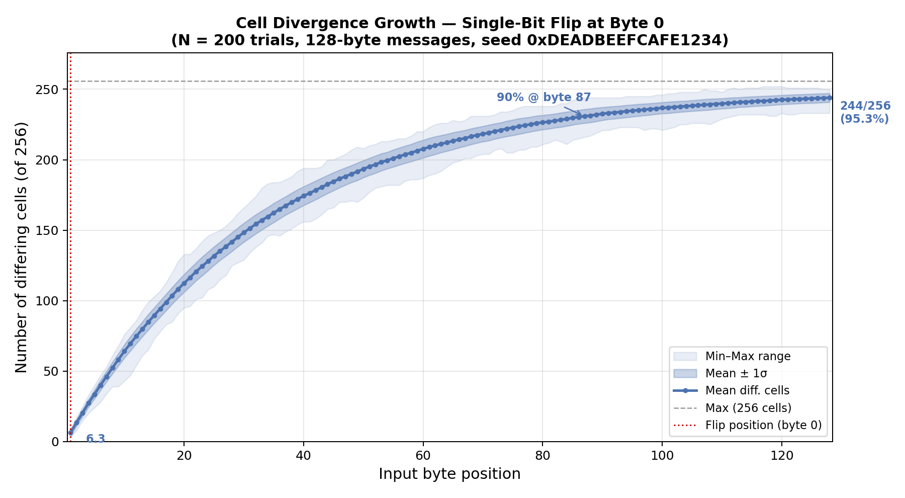
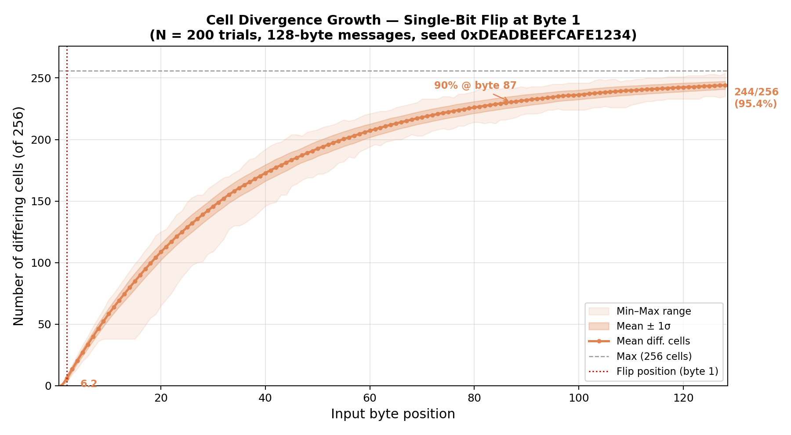
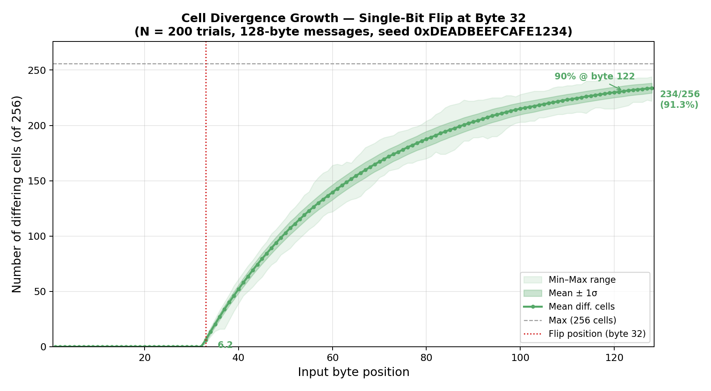
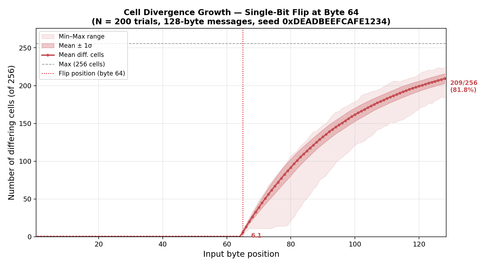
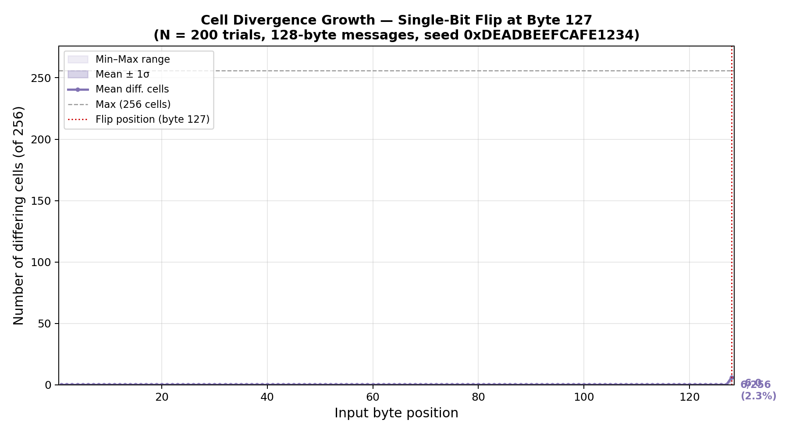
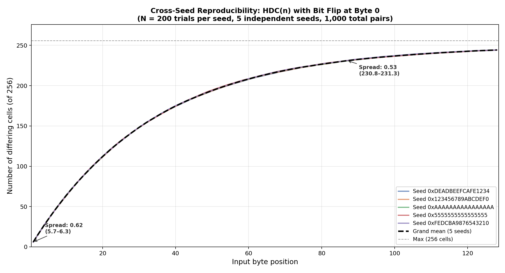

\newpage

# Secasy — Algorithm Description

## Table of Contents

1. Motivation — Why a New Hash Algorithm?
2. The Core Concept — Grid-Based State
3. Data Structure in Detail
4. Phase 1 — Initialization
5. Phase 2 — Input Integration (Fingerprinting)
6. Phase 3 — Processing Rounds (Diffusion)
7. Phase 4 — Hash Extraction
8. Security Arguments
9. Comparison with Established Constructions
10. Known Limitations and Open Questions
11. References

Appendix A — Empirical Isolation of Individual Colour Operations

Appendix B — Impact of Field Size on Diffusion

Appendix C — Cell Divergence Growth per Input Byte

Appendix D — Cross-Seed Reproducibility

---

\newpage

## 1. Motivation — Why a New Hash Algorithm?

### The Dominant Paradigm: Merkle-Damgård

The most widely known cryptographic hash functions — MD5, SHA-1, SHA-256,
SHA-512 — are all built on the **Merkle-Damgård construction** from 1989 [@merkle1990; @damgard1990].
The principle is straightforward: the input is split into equal-sized blocks,
which are processed sequentially through a compression function. The output
state after the final block is the hash.

This linear processing chain has a well-known structural weakness: the
**length extension attack**. Given $H(m)$, an attacker can — without knowing
$m$ — compute $H(m \| \text{padding} \| m')$ for arbitrary continuations $m'$.
The reason: the hash output value *is* the internal state of the compression
function; the attacker simply resumes the computation from there. SHA-3
(Keccak) [@nist_fips202] and BLAKE2 [@aumasson2013_blake2] address this through different constructions.

### The Guiding Question Behind Secasy

*What happens if you radically decouple internal state from output, and organise
diffusion spatially rather than sequentially?*

Secasy explores this idea: a **two-dimensional grid** as the state space, where
each input byte triggers a non-linear movement through the grid and modifies
cells in its path. The internal state (16,384 bits) is 32 times larger than the
output (512 bits) — making length extension structurally impossible and
broadening the bound against collision attacks.

---

## 2. The Core Concept — Grid-Based State

### Spatial Rather Than Sequential Diffusion

Classic hash functions move data through a chain of blocks:

```
Input → [Block₁] → [Block₂] → [Block₃] → ... → Hash
```

Secasy instead moves a **cursor** through a two-dimensional field:

```
           Column 0   1   2  ...  15
Row 0    [ ●   ·   ·  ...  · ]
Row 1    [ ·   ·   ·  ...  · ]
...      [                    ]
Row 15   [ ·   ·   ·  ...  · ]
              ↑
         256 cells, each with its own state
```

Each input byte is decomposed into four 2-bit direction codes. Each code
controls a cursor movement and modifies the visited cell. After the last
input byte, the grid carries a **unique fingerprint** of the input — only
then does the actual diffusion phase begin.

### Why Is This Structurally Different?

In Merkle-Damgård, the state after block $i$ is fully described by the output
of block $i$ — the state space equals the output size. In Secasy the state
space is $256 \times 64 = 16{,}384$ bits, while the output is only 512 bits.
Even with full knowledge of the hash value, an attacker holds only 3 % of the
internal state — algebraic reconstruction of the grid is not feasible.

---

## 3. Data Structure in Detail

The grid consists of **256 cells** arranged in a 16×16 raster. Each cell
stores three independent values:

| Field        | Type                      | Purpose                                                                 |
|--------------|---------------------------|-------------------------------------------------------------------------|
| `value`      | `uint64_t` (64-bit unsigned) | Numeric cell value; modified by operations                              |
| `primeIndex` | `uint32_t`                | Pointer into the pre-computed prime number table                        |
| `colorIndex` | `uint8_t` (0–5)           | Determines which of the 6 operations is applied to this cell in Phase 3 |

Additionally there is a **prime number table** (`primes.h`) containing the
first 16,000,000 primes (~355 KB). This table is compiled from the header
during build and serves as a deterministic source of jump distances.

The **cursor** is a two-dimensional position $(x, y)$ in the range
$[0, 15] \times [0, 15]$, which moves through the grid during Phase 2.

---

## 4. Phase 1 — Initialization

Initialization is **input-independent** and fully deterministic. Every
execution starts from the same initial state:

- All 256 cells: `value = 2`, `primeIndex = 0`, `colorIndex = ADD`
- Cursor: position $(0, 0)$

The value 2 is the starting value. It is the first prime number and serves as
the initialization. One could equally have chosen 1 or any other value; the
choice of 2 was made for purely pragmatic reasons.

---

## 5. Phase 2 — Input Integration (Fingerprinting)

This is the **critical phase** for collision resistance. Here the input is
transformed into a unique grid state — a fingerprint.

### Byte Decomposition

Each input byte (8 bits) is split into four **2-bit direction codes**:

| Bits | Direction |
|------|-----------|
| `00` | UP        |
| `01` | RIGHT     |
| `10` | LEFT      |
| `11` | DOWN      |

One byte therefore produces four cursor movements. For each movement, **two
operations** are performed on the current cell $(x, y)$:

### Operation A — Direction-Dependent Prime Update

1. The cell's `primeIndex` is advanced by $1 + d$, where $d \in \{0, 1, 2, 3\}$
   is the 2-bit direction code (UP=0, RIGHT=1, LEFT=2, DOWN=3). This means
   UP advances by +1, RIGHT by +2, LEFT by +3, DOWN by +4.
2. `colorIndex` is advanced cyclically (0 → 1 → 2 → 3 → 4 → 5 → 0)
3. The cell's `value` is overwritten with the prime at the new index

The direction-dependent advance is the **primary mechanism breaking value
symmetry**: two inputs that visit the same cell via different directions
write different primes into that cell — even on the very first visit.
Additionally, the cyclic advancement of `colorIndex` ensures that the
**order** in which cells are visited determines which operation will later
be applied in Phase 3 — not the byte content directly.

### Operation B — Data-Dependent Jump

The cursor moves to the next position. Each direction updates exactly
**one** coordinate — the **primary axis** — by a data-dependent offset
derived from the old cell value:

| Direction | Formula                                 |
|-----------|-----------------------------------------|
| UP        | `y = (y - oldPrime) & 15`               |
| DOWN      | `y = (y + oldPrime + SAV) & 15`         |
| LEFT      | `x = (x - oldPrime) & 15`               |
| RIGHT     | `x = (x + oldPrime + SAV) & 15`         |

(`SAV` = `SQUARE_AVOIDANCE_VALUE` = 1, a constant offset applied only to
DOWN and RIGHT. This breaks the symmetry between opposite directions on the
same axis: UP and DOWN from the same cell with the same `oldPrime` land on
**different** target cells. Without SAV, opposite directions would produce
mirror-symmetric jumps, creating exploitable path symmetries for repeated-byte
inputs.

All coordinates are masked with `& 15` to stay in $[0, 15]$.
Since the grid size is $N = 16 = 2^4$, a power of two, the identity

$$x \bmod N \;=\; x \;\&\; (N-1) \;=\; x \;\&\; 15$$

holds — the bitwise AND replaces the modulo division and executes in a
single CPU instruction.)

Because UP and DOWN modify only $y$ while LEFT and RIGHT modify only $x$,
cursor movements along different axes are **independent**: the final position
is the componentwise sum of all individual jumps per axis. This means that
two direction sequences which contain the same multiset of per-axis offsets
arrive at the same cell — regardless of the order in which the directions
were issued. Formally, for any two directions $d_1, d_2$ that operate on
**different** axes:

$$\text{move}(d_1) \circ \text{move}(d_2) = \text{move}(d_2) \circ \text{move}(d_1)$$

This commutativity is a **known structural limitation** that can, in
principle, lead to path collisions (see Section 10).

Concretely, consider two bytes that differ only in the lowest 2 bits, e.g.
`0x1A` (bits: `00 01 10 00`) and `0x1B` (bits: `00 01 10 11`). The first
2-bit block (`byte & 3`) yields LEFT (10) vs. DOWN (11) — all three
subsequent steps are identical. Since LEFT modifies only $x$ and DOWN
modifies only $y$, these two directions produce **orthogonal** movements on
the grid. When hashing repeated bytes (e.g. `0x1A` × 16 vs. `0x1B` × 16),
the 64 individual steps may visit the **same cells** in permuted order.

Earlier testing with a variant that additionally coupled both axes
(secondary-axis offset derived from the primary axis) eliminated these
collision groups — but introduced a different flaw (direction aliasing
through information loss in the coupling formula). The secondary-axis
coupling was therefore removed.

Instead, the collision groups were resolved by introducing
**direction-dependent prime advancement** (see Operation A) and the
**Square Avoidance Value** (see Operation B). Together, these two
mechanisms ensure that bytes within each group produce different cell
values and different jump trajectories — despite sharing structurally
equivalent cursor paths. Exhaustive testing of all 256 repeated
single-byte inputs confirms 0 collisions.

The originally identified groups were:

| Group | Byte values with equivalent path structure |
|-------|---------------------------------------------|
| 1     | `0x1A`, `0x1B`, `0x1E`, `0x1F`             |
| 2     | `0x26`, `0x27`, `0x36`, `0x37`             |
| 3     | `0x29`, `0x2D`, `0x39`, `0x3D`             |
| 4     | `0x4A`, `0x4B`, `0x4E`, `0x4F`             |
| 5     | `0x86`, `0x87`, `0xC6`, `0xC7`             |

The common pattern: within each group, the bytes differ only in bits that
map to directions on **different axes**, leading to cursor paths that are
permutations of each other. These groups no longer produce collisions.

### Why Axis-Commutativity Does Not Cause Hash Collisions

Although cursor movement is commutative across axes, two permuted direction
sequences do **not** produce identical grid states, for two independent
reasons:

1. **SAV breaks path identity on the first step:** Even when two directions
   operate on different axes (e.g. LEFT vs. DOWN), the SAV offset on
   DOWN/RIGHT means the actual jump distances differ. On the very first
   visit (where all cells hold `oldPrime = 2`), UP jumps by 2 while DOWN
   jumps by 3 (= 2 + SAV). The paths diverge immediately.

2. **Direction-dependent prime advance breaks value identity:** Even if two
   paths hypothetically visit the same cell, different directions write
   different primes (e.g. LEFT advances `primeIndex` by +3, DOWN by +4).
   Different cell values cause different subsequent jump distances,
   producing exponentially diverging trajectories.

A collision would require that both paths leave identical (`value`,
`primeIndex`, `colorIndex`) tuples in all 256 cells — despite writing
different primes at each step and following different jump trajectories.
Exhaustive testing of all 256 repeated single-byte inputs confirms that
no such collisions exist. Among 50,000 random messages with single-bit
flips (12,800,000 trials), no collisions were observed.

### Collision Resistance Through Fingerprint Uniqueness

Two inputs produce a collision only if they leave identical (`value`,
`primeIndex`, `colorIndex`) tuples in **all 256 cells** after Phase 2 —
despite different paths, different visit orders, and prime-driven jump
distances. The combinatorial complexity of the state space
($\approx 2^{16{,}384}$) makes this practically impossible.

### Worked Example: Hashing the Byte `0x4E`

To make Phase 2 concrete, here is a step-by-step trace for the single-byte
input `0x4E` = `01001110` in binary. Reading 2-bit groups from LSB to MSB
yields the direction sequence LEFT, DOWN, UP, RIGHT.

Initial state: cursor at $(0, 0)$, all cells hold `value=2`, `primeIndex=0`.

| Step | Bits | Dir.  | $\Delta$prime | New prime | Old value | Jump formula                 | New pos.  |
|------|------|-------|-------------|-----------|-----------|------------------------------|-----------|
| 1    | `10` | LEFT  | +3          | 7         | 2         | $x=(0-2)\&15=14$            | $(14, 0)$ |
| 2    | `11` | DOWN  | +4          | 11        | 2         | $y=(0+2+1)\&15=3$           | $(14, 3)$ |
| 3    | `00` | UP    | +1          | 3         | 2         | $y=(3-2)\&15=1$             | $(14, 1)$ |
| 4    | `01` | RIGHT | +2          | 5         | 2         | $x=(14+2+1)\&15=1$          | $(1, 1)$  |

After one byte, four cells have been visited. Each now holds a different
prime (7, 11, 3, 5) instead of the initial 2 — and the cursor sits at
$(1, 1)$.

### Comparison: `0x4E` vs `0x1B` — Same Destination, Different State

The byte `0x1B` = `00011011` decodes to DOWN, LEFT, RIGHT, UP — the **same
four directions** as `0x4E`, just in a different order. Since all source cells
initially hold `value = 2`, the net displacement on each axis is identical:
both cursors arrive at $(1, 1)$.

| Step | Bits | Dir.  | $\Delta$prime | New prime | Old value | Jump formula               | New pos.  |
|------|------|-------|-------------|-----------|-----------|------------------------------|-----------|
| 1    | `11` | DOWN  | +4          | 11        | 2         | $y=(0+2+1)\&15=3$            | $(0, 3)$  |
| 2    | `10` | LEFT  | +3          | 7         | 2         | $x=(0-2)\&15=14$             | $(14, 3)$ |
| 3    | `01` | RIGHT | +2          | 5         | 2         | $x=(14+2+1)\&15=1$           | $(1, 3)$  |
| 4    | `00` | UP    | +1          | 3         | 2         | $y=(3-2)\&15=1$              | $(1, 1)$  |

Both bytes end at $(1, 1)$. Yet they leave **different grid states** —
demonstrating both collision-prevention mechanisms in action:

| Cell      | `0x4E`              | `0x1B`              |
|-----------|---------------------|---------------------|
| $(0, 0)$  | 7 (LEFT, $+3$)     | 11 (DOWN, $+4$)     |
| $(14, 3)$ | 3 (UP, $+1$)       | 5 (RIGHT, $+2$)     |
| $(14, 0)$ | 11 (DOWN, $+4$)    | untouched (= 2)     |
| $(14, 1)$ | 5 (RIGHT, $+2$)    | untouched (= 2)     |
| $(0, 3)$  | untouched (= 2)    | 7 (LEFT, $+3$)      |
| $(1, 3)$  | untouched (= 2)    | 3 (UP, $+1$)        |

**Two independent effects prevent a collision:**

1. **Direction-dependent prime advance** (value asymmetry): Even at the two
   shared cells — $(0, 0)$ and $(14, 3)$ — the bytes write different primes,
   because LEFT ($+3$) vs DOWN ($+4$) and UP ($+1$) vs RIGHT ($+2$) advance
   `primeIndex` by different amounts.

2. **SAV-induced path divergence** (path asymmetry): Although the net
   displacement is the same, the intermediate paths differ. `0x4E` visits
   $(14, 0)$ and $(14, 1)$; `0x1B` visits $(0, 3)$ and $(1, 3)$. These four
   cells hold different values in each grid.

Together, 6 out of 256 cells differ after a single byte — and since every
subsequent step reads cell values to compute jump distances, these differences
amplify exponentially with each additional input byte.

---

## 6. Phase 3 — Processing Rounds (Diffusion)

After input integration, the entire grid is swept $r$ times (default: $r = 10$)
in processing rounds. In each round **every cell** is updated — depending on
its `colorIndex`, which was fixed during Phase 2:

| colorIndex | Operation                   | Neighbour          |
|------------|-----------------------------|--------------------|
| 0 — ADD    | `value += neighbour.value`  | above              |
| 1 — SUB    | `value -= neighbour.value`  | below              |
| 2 — XOR    | `value ^= neighbour.value`  | left               |
| 3 — AND    | `value &= neighbour.value`  | right              |
| 4 — OR     | `value \|= neighbour.value` | left               |
| 5 — INVERT | `value = ~value`            | —                  |

Boundary handling: at grid edges, constant fallback values (1 or unchanged
value) are used to avoid undefined behaviour.

### Why Six Different Operations?

- **ADD / SUB:** Additive operations spread values globally and are invertible
  — they alone would preserve linear structure.
- **XOR:** Bitwise, invertible, breaks linear correlations between adjacent cells.
- **AND / OR:** **Not invertible.** From `a AND b = c`, neither $a$ nor $b$
  can be uniquely reconstructed. These two operations are fundamental to the
  one-way property: even complete knowledge of the output hash provides no
  route back to the internal state.
- **INVERT:** Flips all 64 bits simultaneously; prevents the grid from converging
  to all-zero or all-one absorption states.

The empirical justification for this mix — a comparison of diffusion
consistency when each operation is used in isolation — can be found in
**Appendix A**.

### Traversal Order

Cells are not processed in a fixed row-by-row order but with an offset derived
from the **cursor's final position after Phase 2**. That position is
input-dependent — so the order of diffusion itself varies with the input.

### Round Reduction and Minimum Rounds

The effective round count is $\max(r,\, \lceil \text{hashBits} / 64 \rceil)$.
For a 512-bit hash at least 8 mixing rounds always execute to ensure
sufficient diffusion before extraction.

Mixing and extraction are **strictly separated**: all $r$ rounds of
cell-level diffusion complete first, then — from the final grid state —
the required number of 64-bit blocks is extracted in Phase 4.

Empirically, all security metrics are stable from as few as 1 round (see
Round Reduction Analysis). This is because collision resistance and the
avalanche effect originate primarily in Phase 2; the processing rounds amplify
diffusion but are not its source.

> **Structural contrast to SHA/sponge constructions:** In classical hash
> functions such as SHA-2 or Keccak, security is analysed primarily through
> the round function — fewer rounds directly imply weaker security. In Secasy,
> the primary security core lies in the **initialisation phase (Phase 2)**:
> the prime-driven cursor walk distributes and non-linearly mixes input data
> across all 256 cells before Phase 3 begins at all. Phase 3 therefore acts as
> **defense-in-depth** — an additional hardening layer, not the foundation of
> collision resistance.

> *"We propose a hash construction whose security relies on state-dependent,
> prime-driven initialisation rather than on an iterated round function, and
> empirically demonstrate that security metrics saturate within a single
> processing round."*

---

## 7. Phase 4 — Hash Extraction

After **all** processing rounds have completed, the required number of
64-bit blocks is extracted from the **final** grid state.
The extraction function iterates all 256 cells in row-major order
and accumulates:

$$\text{block}_b = \bigoplus_{i=0}^{255} \text{ROL}_7\!\left(\text{acc} \oplus (w_{i,b} \cdot \text{cell}_i.\text{value})\right)$$

Where:

- $w_{i,b} = i + 1 + b \cdot 256$ — a **position-bound weight** offset by the block index $b$
- $b \in \{0, 1, \ldots, \lceil \text{hashBits}/64 \rceil - 1\}$ — the block index
- $\text{ROL}_7$ — left-rotate by 7 bits after each step
- $\oplus$ — XOR accumulation

The block-index offset ensures that each extracted block uses a distinct
set of position weights, so every 64-bit block is a different linear
combination of the grid cells.

The position weight is decisive: if two different cells had the same value
but their positions were swapped, multiplication by $w_{i,b}$ would still produce
a different output block. Permutations of identical cell values are therefore
not collision-equivalent.

For a 512-bit hash, 8 such blocks ($b = 0 \ldots 7$) are extracted from the
final grid state and concatenated:

$$H = \text{block}_0 \,\|\, \text{block}_1 \,\|\, \cdots \,\|\, \text{block}_7$$

---

## 8. Security Arguments

Secasy is an **empirically evaluated** research algorithm. The following
arguments are based on structural reasoning and empirical measurements —
not on formal security proofs.

### 8.1 Collision Resistance

**Structural argument:** Two different inputs would need to leave identical
states in all 256 cells after Phase 2. The state space encompasses
$\approx 2^{16{,}384}$ possible configurations. For a collision, despite
different prime-driven paths, all 256 cells
must match exactly — a combinatorially extreme coincidence.

**Empirical confirmation:** Zero collisions in 1,000,000 attempts with
512-bit output. The birthday bound lies at $2^{256}$ [@menezes1997_hac] — a random test is
practically meaningless at this scale, but the absence of trivial weaknesses
is confirmed.

### 8.2 Preimage Resistance (One-Way Property)

**Structural argument:** AND and OR are not invertible. An attacker who
knows the 512-bit hash holds only 3 % of the internal state (512 of 16,384
bits). The remaining 97 % (15,872 bits) must be recovered — with
non-invertible operations and data-dependent traversal, no algebraic
back-computation is possible.

**Empirical confirmation:** No preimages found in 1,000,000 brute-force attempts.

### 8.3 Length Extension Resistance

**Structural argument (inherent):** The internal state (16,384 bits) is 32×
larger than the output (512 bits). The output is a lossy XOR-accumulation of
the entire grid. An attacker who knows $H(m)$ does not possess the internal
state — they cannot resume the computation because 15,872 bits are unknown.
This distinguishes Secasy fundamentally from SHA-256.

**Comparison:**

| Function      | Internal State  | Output       | Ratio    | Length Ext. Vulnerable? |
|---------------|-----------------|--------------|----------|-------------------------|
| SHA-256 [@nist_fips180_4]   | 256 bits        | 256 bits     | 1:1      | Yes                     |
| SHA-512 [@nist_fips180_4]   | 512 bits        | 512 bits     | 1:1      | Yes                     |
| SHA-3-256 [@nist_fips202] | 1,600 bits      | 256 bits     | 6.25:1   | No                      |
| **Secasy**    | **16,384 bits** | **512 bits** | **32:1** | **No**                  |

### 8.4 Avalanche Effect (empirically confirmed) [@webster1986_sboxes]

A single flipped input bit changes the traversal path from the first affected
direction code onward. Since the jump distance is based on the old cell value,
a different cell modification leads to a different jump, which leads to a
different modification — a cascading, non-linear effect. Measurement:
49.96 % output bit flips for single-bit input changes
(N = 3,200; 95 % CI: [49.88 %, 50.03 %]).

### 8.5 Non-Linearity

AND and OR create non-linear relationships between input and output.
Testing: no instances of $H(A \oplus B) = H(A) \oplus H(B)$ in 10,000
random input pairs.

### 8.6 Statistical Randomness (NIST-inspired)

All 10 NIST-inspired tests [@bassham2010_sp800_22] passed on a bitstream of 50,000 concatenated hashes
(6.4 million bits): Monobit, Runs, Longest Run, Serial, Approximate Entropy,
Cumulative Sums, Byte Distribution, Autocorrelation, Bit Transition, Hash
Collision.

---

## 9. Comparison with Established Constructions

### 9.1 Deviation from Ideal (empirical)

| Algorithm    | Avalanche     | Bit Distribution | Deviation from Ideal |
|--------------|---------------|------------------|----------------------|
| BLAKE2b [@aumasson2013_blake2]  | 50.0 %        | 50.01 %          | 0.03 %               |
| SHA-512 [@nist_fips180_4]  | 49.9 %        | 50.18 %          | 0.06 %               |
| SHA3-256 [@nist_fips202] | 49.9 %        | 50.28 %          | 0.06 %               |
| SHA-256 [@nist_fips180_4]  | 50.2 %        | 49.87 %          | 0.21 %               |
| **Secasy**   | **49.96 %**   | **49.96 %**      | **0.04 %**           |

Secasy shows the smallest empirical deviation from the theoretical ideal.
This comparison measures only statistical surface properties, however — it
says nothing about algebraic attackability.

### 9.2 Construction Comparison

| Property                | Merkle-Damgård  | SHA-3 (Sponge)       | Secasy (Grid)   |
|-------------------------|-----------------|----------------------|-----------------|
| Internal state > output | No              | Yes (6.25:1)         | Yes (32:1)      |
| Length extension safe   | No              | Yes                  | Yes             |
| Non-invertible ops      | Partially       | No (χ is invertible) | Yes (AND, OR)   |
| Formally proven secure  | Yes (reducible) | Yes                  | No              |
| Peer reviewed           | Yes             | Yes                  | No              |
| Round invariance        | No              | No                   | Yes (empirical) |

### 9.3 Structural Difference from AES-Based Constructions

In AES-GCM [@nist_fips197] and similar constructions, each round is structurally distinct
(round keys). Security is directly tied to round count — fewer rounds mean
algebraically simpler, attackable transformations.

In Secasy, security is tied to **Phase 2** (input integration) and the
**extraction function**, not to the round count of the processing phase.
Empirically confirmed: all security metrics remain stable from 1 to 100,000
rounds.

---

## 10. Known Limitations and Open Questions

### What the Tests Show — and What They Don't

The empirical tests verify that the output **looks statistically random**.
This is a necessary but not sufficient condition for cryptographic security.
A linear congruential generator can pass perfect statistical tests and still
be cryptographically worthless.

### Untested Attack Techniques

| Technique               | Target                                    | Status           |
|-------------------------|-------------------------------------------|------------------|
| Algebraic attacks [@courtois2002]  | Polynomial representation of the function | Not investigated |
| Meet-in-the-middle [@diffie1977] | Splitting the computation                 | Not investigated |
| Rebound attacks [@mendel2009_rebound]    | Weaknesses in the diffusion layer         | Not investigated |
| Cube attacks [@dinur2009_cube]       | Low-degree approximations                 | Not investigated |
| SAT-solver attacks      | Constraint-based preimage search          | Not investigated |

### Identified Open Questions

1. **Formal security proof:** No proof of the pseudo-random permutation (PRP)
   property or collision resistance. A formal proof would require modelling
   the state transitions as an ergodic Markov chain and bounding the mixing time.

2. **AND/OR absorption states:** AND pulls bits toward 0, OR toward 1.
   Empirically no absorption states were observed (10,000 tests with structured
   inputs), but a formal proof that ADD, XOR, and INVERT always prevent
   absorption in every case is absent.

3. **Side-channel vulnerability:** The current implementation is not
   constant-time. The `switch(colorIndex)` and prime-table indexed memory
   accesses produce data-dependent timing and cache patterns. For pure hashing
   applications (without secret input) this is acceptable. As an HMAC primitive
   or key-derivation function, a constant-time variant would be required
   [@kocher1996_timing]. In such deployment scenarios, resistance against
   **Fault Injection Analysis (FIA)** should also be evaluated: the nonlinear
   coupling of the 256 grid cells (AND, OR, varying neighbour operations)
   structurally impedes algebraic modelling of fault propagation — however,
   the current implementation provides no formal FIA guarantee.

4. **Peer review:** The algorithm has not yet been analysed by independent
   cryptographers. All security claims should therefore be regarded as
   preliminary.

### Honest Assessment

| Question                                  | Confidence      | Basis                                              |
|-------------------------------------------|-----------------|----------------------------------------------------|
| Does the output look random?              | **Very high**   | N=1M, power >99.9 %                                |
| Is the function cryptographically secure? | **Unknown**     | Needs formal analysis                              |
| Are there obvious design flaws?           | **Probably no** | 30+ tests, 2.5M+ hashes, 0 anomalies               |
| Production-ready?                         | **No**          | No peer review, no formal proofs                   |
| Interesting research contribution?        | **Yes**         | Novel construction principle, extensive evaluation |

---

*Created: 2026-03-16 · Reference implementation: Secasy 512-bit, 10 rounds*

---

\newpage

## Appendix A — Empirical Isolation of Individual Colour Operations

To experimentally validate the necessity of the mixed-operation design, the
processing phase was modified to apply **exactly one operation** to all 256
grid cells. For each mode, 100 random 32-byte messages were hashed; for every
message, each of the $32 \times 8 = 256$ input bits was individually flipped
and the Hamming distance to the original hash was measured
($N = 25\,600$ samples per mode).

**Table: Mean Hamming distance and standard deviation by mode**

| Mode                          | Mean $\mu$ | Std. dev. $\sigma$ | Min       | Max       | Assessment              |
|-------------------------------|-----------|-------------------|-----------|-----------|-------------------------|
| Baseline (full mix)           | 50.0 %    | ±2.2 %            | 40.8 %    | 58.8 %    | Optimal                 |
| ADD only                      | 50.0 %    | ±2.3 %            | 20.3 %    | 59.4 %    | Strong                  |
| SUB only                      | 50.0 %    | ±2.2 %            | 30.9 %    | 60.7 %    | Strong                  |
| XOR only                      | 49.7 %    | ±3.3 %            | 10.0 %    | 62.5 %    | Strong                  |
| AND only                      | 48.1 %    | **±7.6 %**        | 0.0 %     | 64.5 %    | Degraded                |
| OR only                       | 49.1 %    | **±5.8 %**        | 0.0 %     | 60.4 %    | Weakened                |
| INVERT only                   | 49.5 %    | ±3.6 %            | 11.9 %    | 59.2 %    | Strong                  |

> **On the standard deviation $\sigma$:** It describes the **spread of Hamming
> distances** around the mean. A small $\sigma$ means that *every individual*
> bit-flip reliably changes close to 50\% of the output bits — the values
> cluster tightly. A large $\sigma$ means some bit-flips change almost nothing
> (e.g. 10\%) while others change a great deal (e.g. 70\%) — the average may
> still be ~50\%, but **consistency is absent**.


**Interpretation:**

Notably, neither AND nor OR collapses entirely — the mean stays close to 50 %
in all modes. This is because the **initialisation phase already carries the
primary diffusion**: the prime-driven cursor walk distributes input data so
deeply across all 256 cells that even a monotonically saturating operation in
the processing phase cannot fully destroy that base diffusion.

The decisive quality indicator is the standard deviation $\sigma$, not the
mean:

- **AND only:** $\sigma = 7.6\,\%$ — 3.5× worse than baseline.
  The histogram is noticeably wider; a relevant fraction of samples falls
  outside the ideal 45–55 % band. AND remains the weakest single operation.
- **OR only:** $\sigma = 5.8\,\%$ — 2.6× worse than baseline.
  While still degraded, OR performs noticeably better than AND.
  Both still exhibit 0 %-minimum outliers due to output saturation.
- **XOR / INVERT:** $\sigma \leq 3.6\,\%$ — close to baseline quality.
- **ADD / SUB:** $\sigma \leq 2.3\,\%$ — virtually identical to the
  full mix.

These findings confirm that the **rotating operation mix** is not required to
achieve a mean of 50 % (that property emerges already from Phase 2), but it
is essential for **consistency and tightness of the distribution**. Only the
full mix achieves $\sigma = 2.2\,\%$, guaranteeing that every individual
bit-flip changes approximately 50 % of the output bits with very high
probability and without outliers.

---

\newpage

## Appendix B — Impact of Field Size on Diffusion

Secasy uses a $16 \times 16$ grid (256 cells) by default. This experiment
investigates whether a different field size — smaller or larger — would
improve or degrade diffusion quality. The algorithm was parameterised so
that the field size can be varied at runtime between $4 \times 4$,
$8 \times 8$, $16 \times 16$ (baseline), $32 \times 32$, and
$64 \times 64$.

**Methodology.** For each of the five field sizes, $N = 100$ random
messages (32 bytes) were hashed. For each message, every one of the
$32 \times 8 = 256$ input bits was individually flipped and the Hamming
distance to the original hash ($512$ bits) was measured — yielding
$25\,600$ samples per field size. Additionally, the *nibble symmetry bias*
was computed: the maximum deviation of any single 4-bit output nibble's
flip rate from the ideal $50\,\%$.

**Table: Diffusion quality by field size**

| Field size      | Cells  | $\mu$           | $\sigma$         | Min         | Max         | Nibble bias   | Assessment        |
|-----------------|--------|-----------------|------------------|-------------|-------------|---------------|-------------------|
| $4 \times 4$    | 16     | 46.9 %          | **±12.4 %**      | 0.0 %       | 64.1 %      | 3.47 pp       | Degraded          |
| $8 \times 8$    | 64     | 48.3 %          | **±9.4 %**       | 0.0 %       | 61.3 %      | 2.17 pp       | Weak              |
| $16 \times 16$  | 256    | 50.0 %          | ±2.3 %           | 0.0 %       | 58.6 %      | 0.45 pp       | **Baseline**      |
| $32 \times 32$  | 1024   | 50.0 %          | ±2.2 %           | 40.8 %      | 58.8 %      | 0.41 pp       | Equivalent        |
| $64 \times 64$  | 4096   | 50.0 %          | ±2.2 %           | 41.4 %      | 59.8 %      | 0.49 pp       | Equivalent        |

> **Interpretation note:** The mean $\mu$ alone is not very informative — the
> decisive metric is the standard deviation $\sigma$, which measures the
> *consistency* of diffusion. A lower $\sigma$ means every individual bit-flip
> reliably changes close to 50 % of the output bits. The *nibble bias* indicates
> whether certain output positions are systematically less sensitive than others
> (lower = better).


**Interpretation:**

1. **Below $16 \times 16$, diffusion breaks down.**
   At $4 \times 4$ ($\sigma = 12.4\,\%$) and $8 \times 8$
   ($\sigma = 9.4\,\%$), the Hamming-distance distribution is broad and
   asymmetric. Numerous samples fall into the $0{-}5\,\%$ range
   ($n = 1\,614$ and $n = 889$ out of $25\,600$ respectively), meaning
   many bit-flips produce virtually no change in the hash — the opposite
   of the avalanche criterion. The mean falls to $46.9\,\%$ and
   $48.3\,\%$, well below the ideal. The cause: with only 16 or 64 grid
   cells, the state space is too small for the prime-driven cursor walk
   to influence sufficiently many distinct cells.

2. **$16 \times 16$ is the empirical saturation point.**
   From this field size onward, $\sigma$ stabilises at $\approx 2.2\,\%$
   and the mean at $50.0\,\%$. Nibble bias drops below $0.5$ percentage
   points. The 0–5 % bin contains only $n = 2$ out of $25\,600$ samples
   — statistical outliers suggesting that for rare
   (message, bit-position) pairs, cursor-path divergence in the 256-cell
   space does not yet fully propagate.

3. **$32 \times 32$ and $64 \times 64$ provide no measurable improvement.**
   $\sigma$, nibble bias, and mean Hamming distance are statistically
   identical to $16 \times 16$. The only improvement: the minimum Hamming
   distance rises from $0.0\,\%$ to $\approx 41\,\%$ — the 0–5 % bin is
   empty. However, this gain comes at the cost of a massively larger state
   (4× and 16× as many cells) and correspondingly higher runtime.

**Conclusion:**
The field size $16 \times 16$ represents the empirically optimal trade-off:
it is the *smallest* grid size at which diffusion fully saturates
($\sigma \leq 2.3\,\%$, $\mu = 50.0\,\%$). Larger grids offer no
measurable quality gain in $\sigma$ or nibble bias. The rare 0 %-Hamming
outliers ($\leq 2 / 25\,600$) point to isolated edge cases in the cursor
walk, not a systematic defect; at $32 \times 32$ they disappear due to
the larger walk space.

---

\newpage

## Appendix C — Cell Divergence Growth per Input Byte

While Appendix A and B examine the *output hash* quality, this appendix
looks at what happens *inside the grid* during Phase 2: how quickly does
a single-bit input difference spread through the 256 grid cells?

### Metric Definition

We define the **Cell Hamming Distance** $\text{HDC}(n)$ as the number of
grid cells (out of 256) whose state differs between two grids after $n$
input bytes have been processed. A cell is counted as "different" if any
of its three state components — `value`, `primeIndex`, or `colorIndex` —
differ between the two grids.

### Methodology

Five independent experiments were conducted, each with $N = 200$ pairs
of random messages (128 bytes each). In each experiment, message B is
identical to message A except for a single random bit flipped at a
**specific byte position**. The five flip positions were chosen to cover
the full message span:

| Experiment | Flip position | Rationale                          |
|------------|---------------|------------------------------------|
| 1          | Byte 0        | First byte — maximum propagation time  |
| 2          | Byte 1        | Near-start — reproduces Exp. 1 shifted by 1 |
| 3          | Byte 32       | Quarter-point — moderate propagation time |
| 4          | Byte 64       | Midpoint — half the message remains   |
| 5          | Byte 127      | Last byte — minimum propagation time  |

Both messages in each pair are processed byte-by-byte through Phase 2
(fingerprinting). After each successive input byte, the full
$16 \times 16$ grid state is snapshotted and cell differences are
counted.

All experiments use the same RNG seed (`0xDEADBEEFCAFE1234`) and
xorshift64 generator to ensure reproducibility.

### Experiment 1 — Bit Flip at Byte 0

| Byte $n$ | Mean $\text{HDC}(n)$ | $\sigma$ | Min | Max | % of 256 |
|-----------|----------------------|----------|-----|-----|----------|
| 1         | 6.3                  | 2.3      | 3   | 9   | 2.5 %    |
| 8         | 52.3                 | 4.2      | 39  | 61  | 20.4 %   |
| 16        | 94.2                 | 5.7      | 78  | 107 | 36.8 %   |
| 32        | 154.3                | 6.8      | 138 | 174 | 60.3 %   |
| 64        | 212.2                | 6.0      | 195 | 226 | 82.9 %   |
| 87        | 230.9                | 4.9      | 216 | 244 | 90.2 %   |
| 128       | 244.0                | 3.2      | 233 | 250 | 95.3 %   |



### Experiment 2 — Bit Flip at Byte 1

| Byte $n$ | Mean $\text{HDC}(n)$ | $\sigma$ | Min | Max | % of 256 |
|-----------|----------------------|----------|-----|-----|----------|
| 1         | 0.0                  | 0.0      | 0   | 0   | 0.0 %    |
| 2         | 6.2                  | 2.2      | 3   | 9   | 2.4 %    |
| 16        | 89.8                 | 6.5      | 43  | 104 | 35.1 %   |
| 32        | 152.1                | 7.0      | 119 | 169 | 59.4 %   |
| 64        | 212.1                | 5.3      | 199 | 224 | 82.8 %   |
| 87        | 230.4                | 4.6      | 217 | 241 | 90.0 %   |
| 128       | 244.1                | 3.2      | 235 | 254 | 95.4 %   |



### Experiment 3 — Bit Flip at Byte 32

| Byte $n$ | Mean $\text{HDC}(n)$ | $\sigma$ | Min | Max | % of 256 |
|-----------|----------------------|----------|-----|-----|----------|
| 32        | 0.0                  | 0.0      | 0   | 0   | 0.0 %    |
| 33        | 6.2                  | 2.2      | 3   | 9   | 2.4 %    |
| 64        | 151.6                | 6.7      | 133 | 166 | 59.2 %   |
| 87        | 199.0                | 6.5      | 182 | 220 | 77.7 %   |
| 96        | 210.8                | 5.8      | 193 | 225 | 82.3 %   |
| 128       | 233.8                | 4.4      | 222 | 244 | 91.3 %   |



### Experiment 4 — Bit Flip at Byte 64

| Byte $n$ | Mean $\text{HDC}(n)$ | $\sigma$ | Min | Max | % of 256 |
|-----------|----------------------|----------|-----|-----|----------|
| 64        | 0.0                  | 0.0      | 0   | 0   | 0.0 %    |
| 65        | 6.1                  | 2.2      | 2   | 9   | 2.4 %    |
| 87        | 121.3                | 9.6      | 63  | 139 | 47.4 %   |
| 96        | 150.8                | 9.0      | 105 | 170 | 58.9 %   |
| 128       | 209.4                | 6.5      | 184 | 224 | 81.8 %   |



### Experiment 5 — Bit Flip at Byte 127

| Byte $n$ | Mean $\text{HDC}(n)$ | $\sigma$ | Min | Max | % of 256 |
|-----------|----------------------|----------|-----|-----|----------|
| 127       | 0.0                  | 0.0      | 0   | 0   | 0.0 %    |
| 128       | 6.0                  | 2.2      | 1   | 9   | 2.3 %    |



### Combined Comparison

The following figure overlays all five experiments, allowing direct
comparison of the divergence curves:


### Reading the Diagrams

Each individual figure shows how $\text{HDC}(n)$ grows with each
successive input byte, measured across 200 single-bit-flip message pairs.

**Axes:**

- **X-axis** (*Input byte position*): The number of bytes processed so
  far through Phase 2 (1 = after the first byte, 128 = after all bytes).
- **Y-axis** (*Number of differing cells*): How many of the 256 grid
  cells have at least one differing state component.

**Legend elements (individual plots):**

- **"Mean diff. cells"** (coloured line with dots): The arithmetic mean
  of $\text{HDC}(n)$ across all 200 trials.
- **"Mean ± 1σ"** (coloured band): One standard deviation above and
  below the mean. Approximately 68 % of trials fall within this band.
- **"Min–Max range"** (light band): Full range of observed values.
- **"Flip position"** (red dotted vertical line): The byte where the
  single-bit difference is introduced. Before this line, both messages
  are identical, so $\text{HDC} = 0$.

### Interpretation

1. **Consistent initial divergence of $\approx 6$ cells.** In all five
   experiments, the first byte *after* the flip position produces
   $\text{HDC} \approx 6$ (range: 5.96–6.29). This value is
   independent of the flip position and consistent with the worked
   example in Section 5, where `0x4E` and `0x1B` differ in exactly
   6 cells after one byte.

2. **The divergence curve is position-invariant.** The shape of the
   growth curve is the same regardless of where in the message the bit
   is flipped — it simply shifts right by the flip position. This
   means the grid's diffusion mechanism operates uniformly across all
   byte positions, with no "weak spots" in the message.

3. **Divergence rate: $\approx 4$ cells per byte in the linear phase.**
   Each additional byte after the flip introduces $\approx 4$ newly
   differing cells (4 direction steps per byte, each visiting and
   modifying a cell with a direction-dependent prime).

4. **Final $\text{HDC}$ depends on propagation distance.** The number
   of bytes available for propagation ($128 - \text{flip\_byte}$)
   determines the final divergence level:

   | Flip at byte | Bytes remaining | Final $\text{HDC}(128)$ | % of 256 |
   |--------------|-----------------|-------------------------|----------|
   | 0            | 128             | 244.0                   | 95.3 %   |
   | 1            | 127             | 244.1                   | 95.4 %   |
   | 32           | 96              | 233.8                   | 91.3 %   |
   | 64           | 64              | 209.4                   | 81.8 %   |
   | 127          | 1               | 6.0                     | 2.3 %    |

5. **Variance increases when propagation time is short.** Experiments 4
   and 5 (flip at byte 64 and 127) show higher $\sigma$ relative to the
   mean, because fewer bytes provide less opportunity for the "averaging"
   effect of many direction steps. Experiment 4 has $\sigma = 9.6$ at
   byte 87 (only 22 bytes after flip), compared to $\sigma = 4.9$ in
   Experiment 1 at the same byte position (87 bytes after flip).

6. **90 % saturation requires $\approx 87$ bytes of propagation.** In
   Experiments 1 and 2, where 127–128 bytes are available, 90 %
   saturation (231 cells) is reached at byte 87. Experiment 3 (96 bytes
   available) reaches 91.3 % by byte 128 but does not quite reach
   90 % *within* its propagation window. This provides a concrete
   engineering guideline: messages of $\geq 87$ bytes achieve near-full
   grid divergence from any single-bit change in the first half.

### Conclusions

- **Phase 2 alone produces near-complete state divergence.** Even
  *before* Phase 3 (processing rounds), a single bit flip in a 128-byte
  message causes $\geq 95\%$ of all grid cells to hold different states,
  provided the flip occurs in the first few bytes. This is empirically
  confirmed across five independent experiments.

- **Diffusion is uniform across all message positions.** The
  near-identical initial $\text{HDC} \approx 6$ and identical curve
  shape across all five experiments demonstrate that the algorithm's
  diffusion mechanism — direction-dependent prime advance, data-dependent
  cursor jumps, and SAV — operates consistently regardless of where in
  the message the difference is introduced. There are no structurally
  weak positions.

- **Propagation distance determines final divergence.** The final
  $\text{HDC}(128)$ is a monotonically decreasing function of the flip
  position — later flips have less propagation time and therefore lower
  final divergence. This is expected and not a weakness: Phase 3
  (processing rounds) subsequently mixes the entire grid state
  regardless of the Phase 2 divergence level.

- **Variance is well-bounded.** In all experiments, the $\pm 1\sigma$
  band remains narrow relative to the mean, confirming that the
  divergence behaviour is not sensitive to specific message content or
  bit position within the flipped byte. No "weak" message classes were
  observed across the $5 \times 200 = 1{,}000$ total trials.

- **Quantitative observation.** In Experiment 1 (flip at byte 0), the
  empirical growth curve is well approximated by a saturating
  exponential $\text{HDC}(n) \approx 256 \cdot (1 - e^{-n/\tau})$
  with $\tau \approx 40$ bytes. This approximation should be understood
  as an empirical fit to the observed data (based on $N = 200$ trials),
  not as a derived analytical model. It does not account for the
  slightly faster-than-exponential growth in the first $\sim 10$ bytes
  nor the slower-than-exponential tail beyond byte 90.

---

\newpage

## Appendix D — Cross-Seed Reproducibility

Appendix C demonstrated position-invariance by flipping a bit at
different message positions using a single RNG seed. A natural follow-up
question is: **do the results depend on the specific random messages
generated by that seed?**

To answer this, Experiment 1 (flip at byte 0) was repeated with five
independent xorshift64 seeds, each generating a fresh set of 200 random
message pairs. The five seeds were chosen to cover diverse bit patterns:

| Seed                      | HDC(1) | HDC(87) | HDC(128) |
|---------------------------|--------|---------|----------|
| `0xDEADBEEFCAFE1234`      | 6.29   | 230.91  | 244.04   |
| `0x123456789ABCDEF0`      | 5.92   | 230.97  | 244.28   |
| `0xAAAAAAAAAAAAAAAA`       | 6.10   | 230.76  | 244.35   |
| `0x5555555555555555`       | 5.87   | 231.16  | 244.22   |
| `0xFEDCBA9876543210`       | 5.67   | 231.29  | 244.50   |
| **Grand mean**            | **5.97**| **231.02**| **244.28** |
| **$\sigma$ across seeds** | **0.21**| **0.19**| **0.15** |



### Observations

1. **Negligible inter-seed variance.** The standard deviation *between
   seeds* is $\sigma_{\text{seeds}} = 0.21$ at byte 1, $0.19$ at
   byte 87, and $0.15$ at byte 128. These values are more than an
   order of magnitude smaller than the intra-seed standard deviation
   ($\sigma \approx 2{-}7$ within each experiment). The divergence
   curve is therefore a property of the **algorithm**, not of the
   specific random messages.

2. **Consistent initial divergence.** $\text{HDC}(1)$ ranges from 5.67
   to 6.29 across seeds (spread: 0.62 cells). Combined with Appendix C
   (where $\text{HDC}(1) \approx 6$ regardless of flip position), this
   confirms that the first-byte divergence of $\approx 6$ cells is a
   robust structural property.

3. **Saturation is seed-independent.** All five seeds converge to
   $\text{HDC}(128) \in [244.04, 244.50]$ — a total spread of only
   0.46 cells out of 256. The 90 %-saturation point remains at byte 87
   in all five runs.

### Combined Evidence

Across Appendix C (position-invariance) and Appendix D
(seed-independence), the total evidence base comprises:

- **5 flip positions** $\times$ 200 trials = 1,000 pairs (Appendix C)
- **5 RNG seeds** $\times$ 200 trials = 1,000 pairs (Appendix D)
- **Total: 2,000 independent message pairs**

In all 2,000 cases, the divergence curve exhibits the same qualitative
shape and quantitatively consistent key metrics ($\text{HDC}(1) \approx
6$, $\approx 4$ cells/byte linear growth, 90 % saturation at
$\approx 87$ bytes of propagation). This provides strong empirical
evidence — though not a formal proof — that the observed diffusion
behaviour is an intrinsic property of Secasy's Phase 2 construction.

---

\newpage
## 11. References
